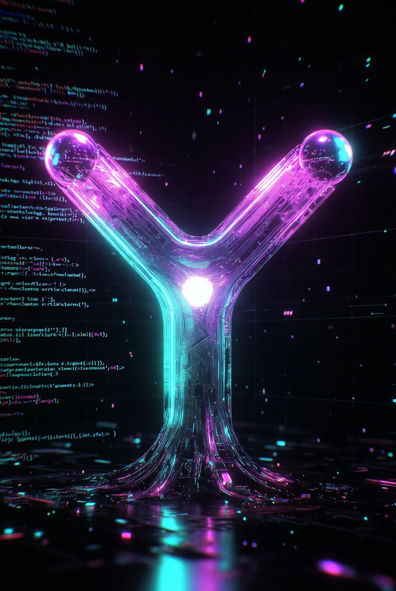
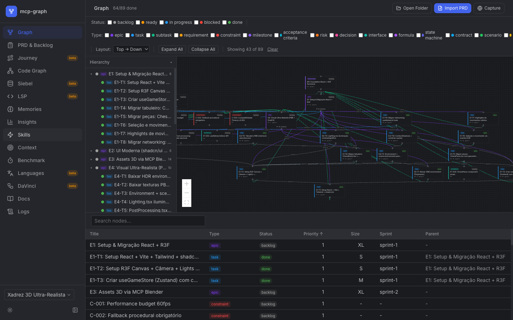
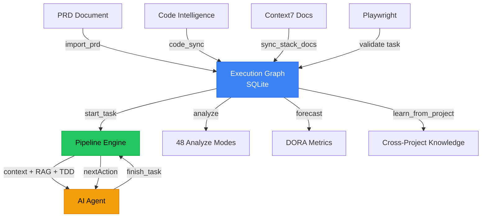
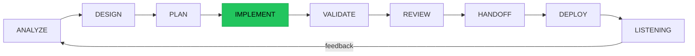
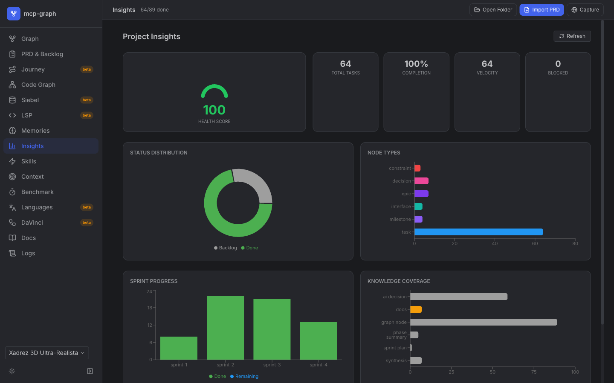
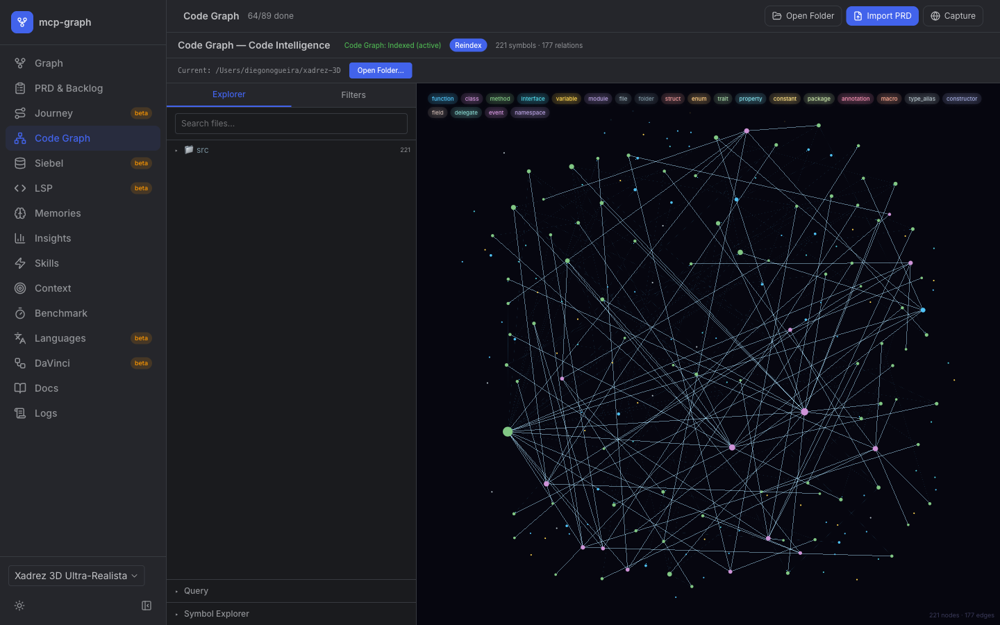
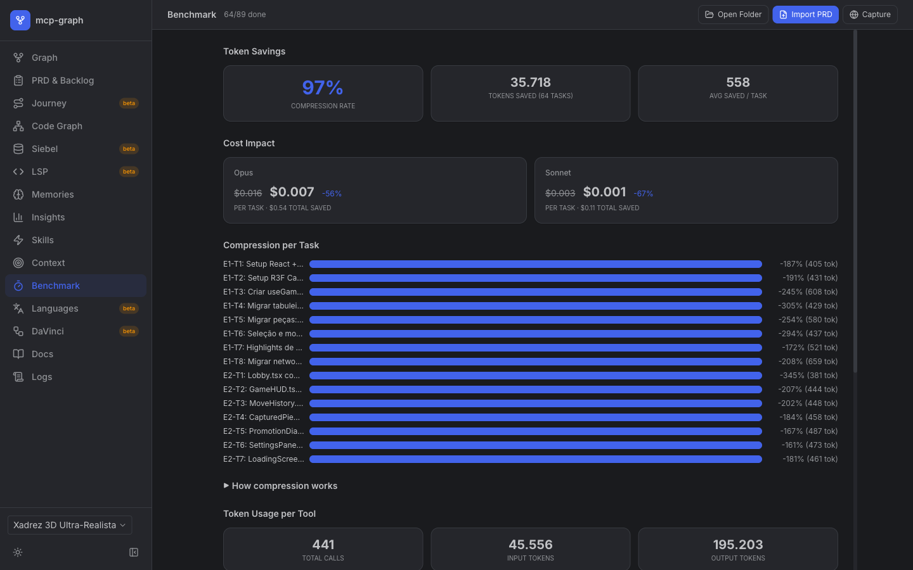
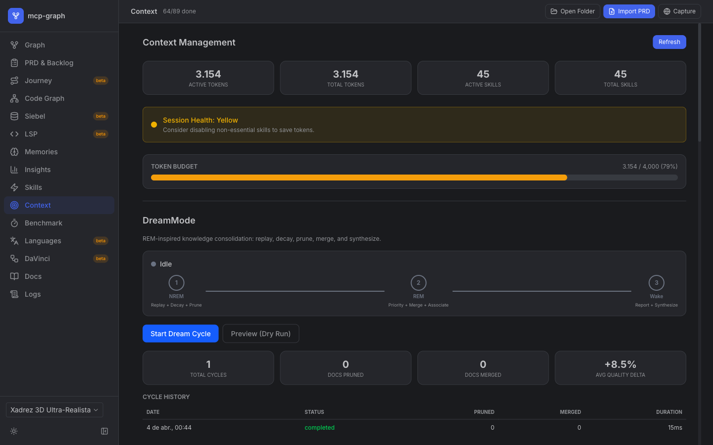

<p align="center">
  
</p>

<h1 align="center">mcp-graph</h1>

<p align="center">
  <strong>Autopilot for AI-driven development.</strong><br/>
  Local-first CLI that converts PRDs into execution graphs with 45 unified tools, spec-driven development, and predictive analytics.
</p>

<p align="center">
  <a href="https://github.com/DiegoNogueiraDev/mcp-graph-workflow/actions/workflows/ci.yml"></a>
  <a href="https://www.npmjs.com/package/@mcp-graph-workflow/mcp-graph"></a>
  <a href="https://nodejs.org"></a>
  <a href="https://opensource.org/licenses/MIT"></a>
  <a href="https://www.typescriptlang.org/"></a>
  <a href="CONTRIBUTING.md"></a>
</p>

<p align="center">
  <a href="https://www.npmjs.com/package/@mcp-graph-workflow/mcp-graph"></a>
  <a href="https://github.com/DiegoNogueiraDev/mcp-graph-workflow/stargazers"></a>
  <a href="https://github.com/DiegoNogueiraDev/mcp-graph-workflow/network"></a>
  
  
  
  
</p>

<p align="center">
  
</p>

---

## What is mcp-graph?

A **local-first MCP server** that transforms product requirement documents (PRD) into persistent execution graphs (SQLite), with an integrated knowledge store, RAG pipeline, and multi-agent orchestration mesh.

**v8.0** brings **tool consolidation** (21 tools merged into 5 unified action-based tools), a **spec-driven development platform** (constitution, plugins, presets, living specs), **NLP engine quality** (stemming, fuzzy search), and **auto-promote epics** with cascade status. Built on v7.0's unified gate system, deterministic-first architecture, and **5,800+ tests**.

## Quick Start

### GitHub Copilot (VS Code)

Create `.vscode/mcp.json` in your project:

```json
{
  "servers": {
    "mcp-graph": {
      "type": "stdio",
      "command": "npx",
      "args": ["-y", "@mcp-graph-workflow/mcp-graph"]
    }
  }
}
```

Enable **Agent Mode** in Copilot Chat, then: `init` your project and use `start_task` to begin.

### Claude Code / Cursor / IntelliJ

Add to `.mcp.json`:

```json
{
  "mcpServers": {
    "mcp-graph": {
      "command": "npx",
      "args": ["-y", "@mcp-graph-workflow/mcp-graph"]
    }
  }
}
```

### Windsurf / Zed / Other MCP Clients

```
npx -y @mcp-graph-workflow/mcp-graph
```

### From Source

```bash
git clone <repo-url> && cd mcp-graph-workflow
npm install && npm run build
npm run dev        # HTTP + dashboard at localhost:3000
```

> For detailed setup, see [Getting Started](docs/guides/GETTING-STARTED.md).

---

## v8.0 — What's New

### Tool Consolidation (v8.0)

21 individual tools merged into 5 unified action-based tools:

| Unified Tool | Absorbs | Actions |
|--------------|---------|---------|
| `context` | `rag_context`, `context_compress` | `compact`, `rag`, `compress`, `batch_compress` |
| `knowledge` | 5 `knowledge_*` tools | `stats`, `export`, `feedback`, `prune`, `reindex` |
| `davinci` | 3 `davinci_*` tools | `analyze`, `build`, `convert` |
| `siebel` | 8 `siebel_*` tools | `analyze`, `compose`, `env`, `generate`, `search`, `validate` |
| `translate` | 3 `translate_*` tools | `convert`, `analyze`, `jobs` |

### Spec-Driven Development Platform (v8.0)

6 new MCP tools for structured project governance:

| Tool | Purpose |
|------|---------|
| `constitution` | Project governing principles with RAG indexing |
| `plugin` | Dynamic extension system with 8 hook points |
| `preset` | Workflow customization (4 built-in: default, strict-tdd, agile-light, enterprise) |
| `spec` | Structured spec templates per lifecycle phase |
| `spec_sync` | Living specs with versioning and bidirectional graph sync |
| `agent_format` | Multi-agent instruction generator (markdown, TOML, skill.md, JSON) |

### Additional v8.0 Features

- **Auto-promote epics** — recursively promotes parent epic to `done` when all children complete
- **Cascade status** — auto-marks `acceptance_criteria` and `subtask` children as `done`
- **NLP engine quality** — unified tokenizer with built-in stemming (EN/PT), fuzzy search fallback
- **GraphRAG community summaries** — community detection for knowledge consolidation

## v7.0 Highlights

### Benchmark Results (Real Project: 415 nodes, 923 edges)

| Metric | Value | Rating |
|--------|-------|--------|
| Deployment Frequency | 25.4 tasks/day | **Elite** |
| Lead Time (P50) | 14.9 hours | **Elite** |
| Change Failure Rate | 0% | **Elite** |
| MTTR | 0 hours | **Elite** |
| Tests | 5,800+ passing | 0 failures |
| Benchmark SLOs | 24/24 | 100% pass |
| AI Fallback | 0% | **Deterministic-First** |

### Performance Benchmarks (Vitest Bench — real data)

| Component | Operation | Throughput | Latency (mean) |
|-----------|-----------|-----------|----------------|
| **BM25 Ranking** | 50 chunks, k1=1.8 | 2,577 ops/s | 0.39ms |
| **RAG Router** | Simple query routing | 1,134,757 ops/s | 0.9μs |
| **RAG Router** | Complex query E2E | 268,956 ops/s | 3.7μs |
| **Kanban Metrics** | 100 tasks board+metrics | 29,738 ops/s | 33μs |
| **Kanban Metrics** | 500 tasks board+metrics | 5,852 ops/s | 171μs |
| **Hybrid RAG** | BM25-only (500 nodes) | 18,630 ops/s | 54μs |
| **Hybrid RAG** | BM25+Semantic (100 nodes) | 1,760 ops/s | 568μs |
| **Semantic Search** | 50 embeddings similarity | 4,060 ops/s | 246μs |
| **Self-Healing** | Health scan 200 nodes | 4,671 ops/s | 214μs |

> All benchmarks run locally on SQLite — zero external dependencies. Full results: `npx vitest bench`

### Key Improvements over v6

| Feature | v6 | v7 | Impact |
|---------|----|----|--------|
| Tool gate wrapping | 2 sequential wrappers | 1 unified gate | **-50% overhead/call** |
| Registered tools | 53 + 6 deprecated | 45 unified (v8) | **-15% surface** |
| Security | 3 fragmented checks | 1 centralized (20 attack vectors) | **Hardened** |
| Knowledge pruning | Manual only | Autoprune + dedup deletion + budget | **Automated** |
| Graph diagnostics | Individual analyzers | Unified health scanner | **1 scan = 6 checks** |
| Skills catalog | 30 lifecycle skills | **155 skills** (audio, CV, IoT, NLP, ML) | **+417%** |
| Schema integrity | NULLs possible | Migration v30 backfill | **Zero NULLs** |
| FTS indexes | Accumulated since v1 | Rebuilt fresh | **Clean perf** |
| Harnessability Score | — | 4-dimension agent-readiness metric (types, tests, fitness, docs) | **Measurable** |

### Deterministic-First Architecture

All 45 MCP tools operate without any AI/LLM dependency:

```
L0 SQL (55%) ████████████████████████████  32 tools
L1 Cache (5%)  ███                          3 tools
L2 Heuristic (19%) ██████████              11 tools
L3 Property (5%)   ███                      3 tools
L4 Meta-Rule (3%)  ██                       2 tools
AI Fallback (0%)                            0 tools
```

> Full benchmark: [docs/BENCHMARK-v7.md](docs/BENCHMARK-v7.md) | Migration guide: [docs/MIGRATION-v7.md](docs/MIGRATION-v7.md)

---

## 155 Engineering Skills

mcp-graph includes 155 ready-to-use skills covering the entire software development lifecycle and beyond:

| Category | Count | Examples |
|----------|-------|---------|
| **Lifecycle** | 9 | `/graph-implement`, `/graph-deploy`, `/graph-validate` |
| **Quality** | 6 | `/graph-security`, `/graph-tests`, `/graph-observability` |
| **Engineering** | 4 | `/graph-performance`, `/graph-refactor`, `/graph-api-design` |
| **Operations** | 4 | `/graph-incident`, `/graph-cicd`, `/graph-accessibility` |
| **Governance** | 6 | `/graph-architecture`, `/graph-release`, `/graph-docs` |
| **Nirvana Autonomous** | 5 | `/graph-nirvana-quality-guardian`, `/graph-nirvana-swarm-orchestrator` |
| **Audio/Video** | 15 | `/graph-audio-speech-to-text`, `/graph-video-summarizer` |
| **Computer Vision** | 11 | `/graph-cv-ocr-engine`, `/graph-cv-object-detection` |
| **IoT / Sensors** | 10 | `/graph-iot-sensor-data-fusion`, `/graph-iot-predictive-maintenance` |
| **ML / AI Ops** | 12 | `/graph-auto-ml-pipeline`, `/graph-ml-evaluation-framework` |
| **NLP** | 8 | `/graph-nlp-entity-extractor`, `/graph-nlp-sentiment-analyzer` |
| **Data Pipeline** | 8 | `/graph-data-lineage-tracker`, `/graph-etl-automation` |
| **PRD** | 1 | `/graph-prd` (7 methodologies: 5W2H, JTBD, Pareto, MoSCoW, INVEST) |
| **+ more** | 61 | Security, chaos, self-healing, observability, advanced RAG |

### Install Skills

```bash
node skills-graph/install.mjs
```

Supports Claude Code, GitHub Copilot, and Codex CLI. See [skills-graph/README.md](skills-graph/README.md) for the full catalog and platform setup guides.

---

## v6.0 Highlights (Historical)

### Pipeline Tools: 6 calls to 2

```
# Before (v5.x) — 6 tool calls per task
next → context → context(rag) → [implement] → analyze(implement_done) → update_status

# After (v6.0+) — 2 tool calls per task
start_task → [implement with TDD] → finish_task
```

`start_task` composes: next + context + RAG + TDD hints + update_status(in_progress).
`finish_task` composes: DoD 9 checks + AC validation + epic promotion + next task.

### Agent State Machine (`nextAction`)

Every tool response now includes `_lifecycle.nextAction` — the graph tells the agent exactly what to do next:

```json
{
  "_lifecycle": {
    "phase": "IMPLEMENT",
    "nextAction": {
      "tool": "start_task",
      "reason": "Task done — start next task",
      "priority": "recommended"
    }
  }
}
```

### DORA Metrics & Forecast

```
forecast(mode: "dora") → {
  deploymentFrequency: 3.2,      // tasks/day
  leadTime: { p50: 2.1, p85: 8.4 },  // hours
  changeFailureRate: 0.03,       // 3%
  mttr: 0.5,                     // hours
  trend: "improving"
}
```

### More v6.0 Features

| Feature | What it does |
|---------|-------------|
| **Cross-Project Learning** | `learn_from_project` imports knowledge from other projects |
| **Code-Aware Graph Sync** | `analyze(code_sync)` detects drift between graph and code |
| **Smart Decompose** | `analyze(smart_decompose)` breaks tasks into subtasks by AC |
| **Cumulative Flow Diagram** | `analyze(cfd)` captures daily status snapshots for flow analysis |
| **Industrial Methodologies** | Little's Law, Six Sigma, Shift-Left Testing principles embedded |

---

## Architecture



## Lifecycle: 9 Phases



Each phase has **gate checks** (`analyze` modes) that must pass before transitioning. In IMPLEMENT, the pipeline flow is: `start_task` (auto-loads context + RAG + TDD hints) then `finish_task` (validates DoD + marks done + returns next).

---

## Features

| Category | Details |
|----------|---------|
| **MCP Tools** | 45 unified tools (v8: 21 merged into 5 action-based + 6 spec-kit) |
| **Analyze Modes** | 48 modes mapped to 9 lifecycle phases |
| **Benchmark SLOs** | 24 SLOs (chaos, RAG, DX) — all passing |
| **Deterministic Score** | 100% — zero AI/LLM dependency in operations |
| **Pipeline Tools** | `start_task` + `finish_task` (v8.0) |
| **Agent State Machine** | `nextAction` in every response |
| **PRD Import** | .md, .txt, .pdf, .html auto-parsed into task trees |
| **Context Compression** | 70-85% token reduction (summary/standard/deep) |
| **Semantic Search + RAG** | BM25 + TF-IDF, phase-aware boosting, 100% local |
| **Sprint Planning** | Velocity metrics, capacity-based, overflow detection |
| **DORA Metrics** | Deploy freq, lead time, CFR, MTTR |
| **Cross-Project Learning** | Knowledge transfer between projects |
| **Code-Aware Sync** | Graph ↔ code drift detection |
| **Spec-Driven Dev** | Constitution, plugins, presets, living specs (v8.0) |
| **Harnessability Score** | 4-dimension composite: types 30%, tests 30%, fitness 20%, docs 20% — `npm run harness:scan` |
| **Dashboard** | 16 tabs: Graph, PRD, Code Graph, Memories, Insights, Specs, and more |
| **Local-First** | SQLite, zero external deps, cross-platform |

## Dashboard

16 tabs covering the full development lifecycle:

| Tab | Purpose |
|-----|---------|
| **Graph** | Interactive execution graph with hierarchy and filters |
| **PRD & Backlog** | Progress tracking with dependency visualization |
| **Journey** | Website journey mapping |
| **Code Graph** | Multi-language code intelligence (13 languages) |
| **Siebel** | SIF import/export and code generation |
| **LSP** | Language Server Protocol status and diagnostics |
| **Memories** | Project knowledge store |
| **Insights** | Health score, sprint progress, knowledge coverage |
| **Skills** | 155 built-in skills by lifecycle phase |
| **Context** | Token management + DreamMode |
| **Benchmark** | Compression rates, cost impact, token usage |
| **Languages** | Code translation between languages |
| **DaVinci** | DaVinci JS to Java plugin converter |
| **Docs** | Live-introspected tools, APIs, guides |
| **Logs** | Real-time structured logs |
| **Specs** | Spec-driven development: constitution, presets, living specs |

<p align="center">
  
</p>

<p align="center">
  
</p>

<p align="center">
  
</p>

<p align="center">
  
</p>

> See historical v6.0 details in the [V6 Features Guide](docs/guides/V6-FEATURES-GUIDE.md).

```bash
npx mcp-graph serve --port 3000    # or: npm run dev
```

---

## v5.x to v6.0

**Zero breaking changes.** All existing tools continue working. v6.0 is purely additive.

| Metric | v5.x | v6.0 | Change |
|--------|------|------|--------|
| Tool calls per task | 6 | 2 | **-67%** |
| Sprint overhead (20 tasks) | 120 calls | 40 calls | **-67%** |
| Agent guidance | None | `nextAction` in every response | **NEW** |
| MCP tools | 46 + 6 deprecated | 52 + 6 deprecated | **+6** |
| Analyze modes | 24 | 48 | **+100%** |
| Test suite | 4200+ | 5111+ | **+22%** |
| Cross-project learning | No | `learn_from_project` | **NEW** |
| DORA metrics | No | `forecast(dora)` | **NEW** |
| Flow tracking (CFD) | No | `analyze(cfd)` | **NEW** |
| Code-aware sync | No | `analyze(code_sync)` | **NEW** |
| Smart decompose | No | `analyze(smart_decompose)` | **NEW** |

### New Tools in v6.0

| Tool | Description |
|------|-------------|
| `start_task` | Pipeline: next + context + RAG + TDD + status in 1 call |
| `finish_task` | Pipeline: DoD + AC + status + epic promo + next in 1 call |
| `forecast` | DORA metrics (deploy freq, lead time, CFR, MTTR) |
| `learn_from_project` | Import knowledge from another project's DB |
| `analyze(cfd)` | Cumulative Flow Diagram data |
| `analyze(code_sync)` | Validate graph vs code index |
| `analyze(smart_decompose)` | Auto-decompose tasks by AC (1 AC = 1 subtask) |

---

## Integrations

| Integration | Role |
|-------------|------|
| **Code Intelligence** | Native LSP-based analysis, 13 languages, impact analysis |
| **Context7** | Library documentation fetching and indexing |
| **Playwright** | Browser-based task validation and A/B testing |
| **DreamMode** | REM-inspired knowledge consolidation (soft-merge, quality decay) |

Native systems: **Code Intelligence** (AST + symbol graph), **Native Memories** (project knowledge store). See [INTEGRATIONS-GUIDE.md](docs/reference/INTEGRATIONS-GUIDE.md).

## Testing

**5,800+ tests** across Vitest files + Playwright E2E specs.

```bash
npm test            # Unit + integration
npm run test:e2e    # Browser E2E (Playwright, local only)
npm run test:coverage  # V8 coverage report
```

## Documentation

| Document | Description |
|----------|-------------|
| [Getting Started](docs/guides/GETTING-STARTED.md) | Step-by-step setup guide |
| [v6.0 Features Guide](docs/guides/V6-FEATURES-GUIDE.md) | Historical: pipeline tools, nextAction, DORA |
| [Architecture](docs/architecture/ARCHITECTURE-GUIDE.md) | System layers, modules, data flows |
| [MCP Tools Reference](docs/reference/MCP-TOOLS-REFERENCE.md) | 45 unified tools, full parameters |
| [REST API Reference](docs/reference/REST-API-REFERENCE.md) | 30 routers, 130+ endpoints |
| [Lifecycle](docs/reference/LIFECYCLE.md) | 9-phase dev methodology |
| [Knowledge Pipeline](docs/architecture/KNOWLEDGE-PIPELINE.md) | RAG, embeddings, context assembly |
| [RAG Strategies](docs/reference/RAG-STRATEGIES.md) | Adaptive Router, Multi-Strategy RRF, Corrective RAG, Graph Community |
| [Integrations](docs/reference/INTEGRATIONS-GUIDE.md) | Code Intelligence, Context7, Playwright |
| [Test Guide](docs/guides/TEST-GUIDE.md) | Test pyramid and best practices |

## Support the Project

If this tool is useful to you, consider supporting its development:

- **Star this repo** — it helps others discover the project
- **Share** — tell your team, post on X/LinkedIn, write about it
- **Contribute** — see [CONTRIBUTING.md](CONTRIBUTING.md). TDD is mandatory — write the failing test first
- **Sponsor** — [GitHub Sponsors](https://github.com/sponsors/DiegoNogueiraDev)

[](https://star-history.com/#DiegoNogueiraDev/mcp-graph-workflow&Date)

## License

[MIT](LICENSE)
