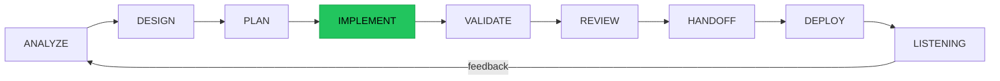
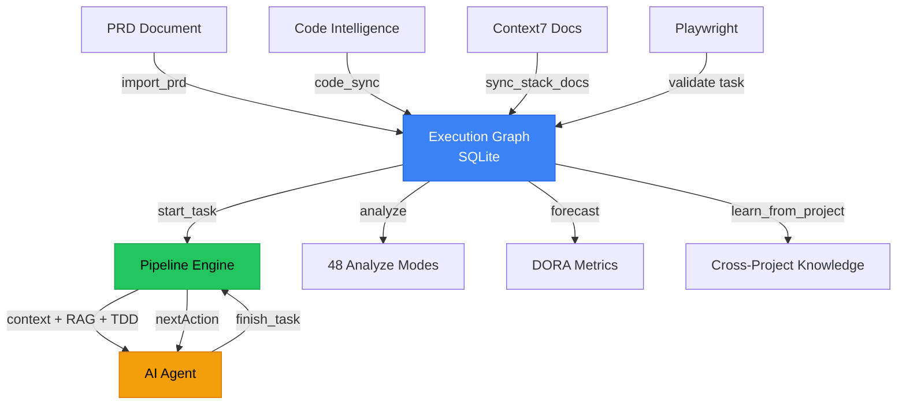

<p align="center">
  
</p>

<h1 align="center">mcp-graph</h1>

<p align="center">
  <strong>Autopilot for AI-driven development.</strong><br/>
  Local-first CLI that converts PRDs into execution graphs with 45 unified tools, spec-driven development, and predictive analytics.
</p>

<p align="center">
  <a href="https://github.com/DiegoNogueiraDev/mcp-graph-workflow/actions/workflows/ci.yml"></a>
  <a href="https://www.npmjs.com/package/@mcp-graph-workflow/mcp-graph"></a>
  <a href="https://nodejs.org"></a>
  <a href="https://opensource.org/licenses/MIT"></a>
  <a href="https://www.typescriptlang.org/"></a>
  <a href="CONTRIBUTING.md"></a>
</p>

<p align="center">
  <a href="https://www.npmjs.com/package/@mcp-graph-workflow/mcp-graph"></a>
  <a href="https://github.com/DiegoNogueiraDev/mcp-graph-workflow/stargazers"></a>
  <a href="https://github.com/DiegoNogueiraDev/mcp-graph-workflow/network"></a>
  
  
  
  
</p>

---

> **Research project — in development since 2025.**
> mcp-graph is an active Master's research project in Computer Engineering at
> **UNOPAR — Universidade Norte do Paraná**, authored by **Diego Lima Nogueira
> de Paula**. The public repository was opened in March 2026, after roughly a
> year of private research. Original methodologies embedded in this system
> (Harnessability Score, Anti-Vibe-Coding lifecycle, Task Readiness Score)
> are documented in [`NOTICE.md`](NOTICE.md). Academic citation is **required**
> when the system is referenced or reimplemented — see
> [How to Cite](#how-to-cite) below. The MIT license grants code reuse;
> academic and derivative work must credit the author.

## What is mcp-graph?

A **local-first MCP server** that transforms product requirement documents (PRD) into persistent execution graphs (SQLite), with an integrated knowledge store, RAG pipeline, and multi-agent orchestration mesh.

It guides every phase of development — from PRD to production — through a structured 9-phase lifecycle, measures your codebase's agent-readiness across 7 dimensions (Harness Engineering), and operates with **zero AI/LLM dependency** at runtime.

**v9.1** brings **multi-terminal orchestration** (teamTask mode with lock-based task claiming, cross-terminal event propagation, orphan task reconciliation), building on v8.0's **tool consolidation** (21 tools merged into 5), **spec-driven development** (constitution, plugins, presets), and **NLP engine quality** (stemming, fuzzy search). Built on v7.0's unified gate system, deterministic-first architecture, and **6,400+ tests**.

## Quick Start

### GitHub Copilot (VS Code)

Create `.vscode/mcp.json` in your project:

```json
{
  "servers": {
    "mcp-graph": {
      "type": "stdio",
      "command": "npx",
      "args": ["-y", "@mcp-graph-workflow/mcp-graph"]
    }
  }
}
```

Enable **Agent Mode** in Copilot Chat, then: `init` your project and use `start_task` to begin.

### Claude Code / Cursor / IntelliJ

Add to `.mcp.json`:

```json
{
  "mcpServers": {
    "mcp-graph": {
      "command": "npx",
      "args": ["-y", "@mcp-graph-workflow/mcp-graph"]
    }
  }
}
```

### Windsurf / Zed / Other MCP Clients

```
npx -y @mcp-graph-workflow/mcp-graph
```

### From Source

```bash
git clone <repo-url> && cd mcp-graph-workflow
npm install && npm run build
npm run dev        # HTTP + dashboard at localhost:3000
```

> For detailed setup, see [Getting Started](docs/guides/GETTING-STARTED.md).

### Daemon mode (opt-in, multi-agent RAM savings)

If you run several Claude Code agents against the **same workspace** in parallel,
each agent otherwise spawns its own mcp-graph process — duplicating the SQLite
handle, ONNX embeddings (~23MB), and LSP child processes per agent.

Switch the bin to `mcp-graph-proxy` to share a single long-lived daemon
per workspace instead:

```json
{
  "mcpServers": {
    "mcp-graph": {
      "command": "npx",
      "args": ["-y", "--package=@mcp-graph-workflow/mcp-graph", "mcp-graph-proxy"]
    }
  }
}
```

- The first agent cold-starts the daemon; subsequent agents in the same
  workspace reuse it via a Unix socket (named pipe on Windows).
- Set `MCP_DAEMON_IDLE_MS=600000` to have the daemon auto-shutdown after
  10 minutes of no connected clients. Omit to keep it alive until kill.
- State lives under `~/.mcp-graph/<workspace-hash>/` (socket + pidfile +
  `daemon.log`). Delete that directory to force a clean restart.

---

## Core Concepts

### 9-Phase Lifecycle

mcp-graph structures all development work into 9 phases, each with gate checks that must pass before transitioning:



| Phase | Purpose | Gate Check |
|-------|---------|------------|
| **ANALYZE** | Define requirements, import PRDs, create graph structure | `analyze(ready)` — requirements + AC exist |
| **DESIGN** | Architecture decisions, technical design, ADRs | `analyze(design_ready)` — interfaces + coupling ok |
| **PLAN** | Sprint planning, task decomposition, dependency mapping | `sync_stack_docs` + `plan_sprint` executed |
| **IMPLEMENT** | TDD Red-Green-Refactor via `start_task` / `finish_task` | `analyze(implement_done)` — DoD 9 checks |
| **VALIDATE** | E2E testing, acceptance criteria verification | `analyze(validate_ready)` — >50% tasks done |
| **REVIEW** | Code review, blast radius analysis, export artifacts | `analyze(review_ready)` — export + blast radius ok |
| **HANDOFF** | Documentation, PR creation, knowledge persistence | `analyze(handoff_ready)` — snapshot + memories saved |
| **DEPLOY** | CI pipeline, release validation, post-deploy checks | `analyze(deploy_ready)` — release validated |
| **LISTENING** | Feedback collection, new cycle initiation | — |

In **IMPLEMENT**, the pipeline flow is: `start_task` (auto-loads context + RAG + TDD hints) then `finish_task` (validates DoD + marks done + returns next). Every tool response includes `_lifecycle.nextAction` — the graph tells the agent exactly what to do next.

> Full methodology: [docs/reference/LIFECYCLE.md](docs/reference/LIFECYCLE.md)

### Harness Engineering

**Harnessability** measures how well a codebase is structured to support effective AI agent assistance. A high score means the codebase has structural properties — type annotations, test files, architecture fitness functions, documentation — that keep AI agents grounded in truth rather than hallucinating.

mcp-graph computes a composite score across **7 dimensions**:

| Dimension | Weight | What it measures |
|-----------|--------|-----------------|
| **Type Coverage** | 25% | TypeScript files without `any` usage |
| **Test Coverage** | 25% | Source modules with corresponding `.test.ts` files |
| **Architecture Fitness** | 15% | Dependency direction, circular deps, barrel export integrity |
| **Docs Coverage** | 15% | CLAUDE.md, README, `.claude/rules/`, `docs/` presence |
| **Naming Clarity** | 10% | Descriptive names (no generic `data`, `result`, `temp`, `val`) |
| **Error Handling** | 5% | Typed errors, no swallowed catches, no `console.error` |
| **Context Density** | 5% | JSDoc coverage on exported functions |

**Grade scale:** A >= 85 (agent-ready) | B >= 70 (reliable) | C >= 55 (fair) | D < 55 (high risk)

```bash
npm run harness:scan                    # CLI scan with human-readable output
# or via MCP: analyze(mode: "harness_scan")
```

The harness score is integrated throughout the system: embedded in every MCP tool `_lifecycle` response, enforced in phase gates (e.g., `deploy_ready` requires grade >= B), and used by the planner to prioritize tasks that improve weak dimensions.

> Full guide: [docs/guides/HARNESS-ENGINEERING.md](docs/guides/HARNESS-ENGINEERING.md)

### Deterministic-First Architecture

All 45 MCP tools operate without any AI/LLM dependency. Every decision is made through a 5-layer deterministic stack:

```
L0 SQL (55%) ████████████████████████████  32 tools — direct SQLite queries
L1 Cache (5%)  ███                          3 tools — cached computation
L2 Heuristic (19%) ██████████              11 tools — rule-based logic
L3 Property (5%)   ███                      3 tools — property-based checks
L4 Meta-Rule (3%)  ██                       2 tools — meta-rule engine
AI Fallback (0%)                            0 tools — zero LLM dependency
```

This means mcp-graph works offline, produces reproducible results, and never hallucinates. The tools **structure** the agent's work — they don't generate code or make creative decisions.

### Spec-Driven Development

v8.0 introduced a governance layer that treats project rules as code:

- **Constitution** — governing principles indexed into RAG for automatic enforcement
- **Plugins** — dynamic extensions with 8 hook points for custom behavior
- **Presets** — workflow customization (4 built-in: `default`, `strict-tdd`, `agile-light`, `enterprise`)
- **Living Specs** — structured templates per lifecycle phase with versioning and bidirectional graph sync

---

## v9.1 — What's New

### Multi-Terminal Orchestrator (teamTask Mode)

Enables multiple Claude Code terminals to work on the same graph without conflicts:

| Feature | What it does |
|---------|-------------|
| **Task Claim Protocol** | `start_task` acquires lock + returns `leaseToken`, `finish_task` verifies ownership, `next` excludes locked tasks |
| **Cross-Terminal Events** | `SqliteEventBridge` publishes/polls events via `event_queue` table (migration v38) |
| **Orphan Task Reconciliation** | `detectOrphanTasks` finds backlog tasks whose code already exists (confidence scoring) |
| **Agent Heartbeat** | Periodic lock renewal (30s) + heartbeat events prevent lock expiry |

Activate: `set_phase({ teamTask: true })`. All features gated — backward compatible when off.

---

## v8.0 — What's New

### Tool Consolidation

21 individual tools merged into 5 unified action-based tools:

| Unified Tool | Absorbs | Actions |
|--------------|---------|---------|
| `context` | `rag_context`, `context_compress` | `compact`, `rag`, `compress`, `batch_compress` |
| `knowledge` | 5 `knowledge_*` tools | `stats`, `export`, `feedback`, `prune`, `reindex` |
| `davinci` | 3 `davinci_*` tools | `analyze`, `build`, `convert` |
| `siebel` | 8 `siebel_*` tools | `analyze`, `compose`, `env`, `generate`, `search`, `validate` |
| `translate` | 3 `translate_*` tools | `convert`, `analyze`, `jobs` |

> For migration from v7.x, see [MIGRATION-v8.md](docs/MIGRATION-v8.md).

### Spec-Driven Development Platform

6 new MCP tools for structured project governance:

| Tool | Purpose |
|------|---------|
| `constitution` | Project governing principles with RAG indexing |
| `plugin` | Dynamic extension system with 8 hook points |
| `preset` | Workflow customization (4 built-in: default, strict-tdd, agile-light, enterprise) |
| `spec` | Structured spec templates per lifecycle phase |
| `spec_sync` | Living specs with versioning and bidirectional graph sync |
| `agent_format` | Multi-agent instruction generator (markdown, TOML, skill.md, JSON) |

### Additional v8.0+ Features

- **Auto-promote epics** — recursively promotes parent epic to `done` when all children complete
- **Cascade status** — auto-marks `acceptance_criteria` and `subtask` children as `done`
- **NLP engine quality** — unified tokenizer with built-in stemming (EN/PT), fuzzy search fallback
- **GraphRAG community summaries** — community detection for knowledge consolidation

---

## Architecture



---

## Features

| Category | Details |
|----------|---------|
| **MCP Tools** | 45 unified tools (v8: 21 merged into 5 action-based + 6 spec-kit) |
| **Analyze Modes** | 48 modes mapped to 9 lifecycle phases |
| **Benchmark SLOs** | 24 SLOs (chaos, RAG, DX) — all passing |
| **Deterministic Score** | 100% — zero AI/LLM dependency in operations |
| **Pipeline Tools** | `start_task` + `finish_task` (v8.0), teamTask mode (v9.1) |
| **Agent State Machine** | `nextAction` in every response |
| **PRD Import** | .md, .txt, .pdf, .html auto-parsed into task trees |
| **Context Compression** | 70-85% token reduction (summary/standard/deep) |
| **Semantic Search + RAG** | BM25 + TF-IDF + ONNX embeddings, phase-aware boosting, 100% local |
| **Sprint Planning** | Velocity metrics, capacity-based, overflow detection |
| **DORA Metrics** | Deploy freq, lead time, CFR, MTTR |
| **Cross-Project Learning** | Knowledge transfer between projects |
| **Code-Aware Sync** | Graph <-> code drift detection |
| **Spec-Driven Dev** | Constitution, plugins, presets, living specs (v8.0+) |
| **Harnessability Score** | 7-dimension composite: types 25%, tests 25%, fitness 15%, docs 15%, naming 10%, errors 5%, context density 5% — `npm run harness:scan` |
| **Dashboard** | 17 tabs: Graph, PRD, Kanban, Code Graph, Harness, Memories, Insights, and more |
| **Local-First** | SQLite, zero external deps, cross-platform |

---

## Knowledge Pipeline & RAG

mcp-graph includes a fully local RAG (Retrieval-Augmented Generation) pipeline — no external APIs, no cloud services:

| Component | Details |
|-----------|---------|
| **Sources** | Memories, docs, web captures, code context, uploaded files |
| **Storage** | SQLite FTS5 with SHA-256 dedup and content-addressable indexing |
| **Embeddings** | TF-IDF local vectors + ONNX semantic embeddings (all-MiniLM-L6-v2, 384-dim) |
| **Search** | BM25 ranking + phase-aware boosting + adaptive routing (simple/complex/graph) |
| **Context Assembly** | 4 tiers: summary (~20 tokens), brief (~80), standard (~150), deep (~500+) — 70-85% token reduction |

> Architecture: [KNOWLEDGE-PIPELINE.md](docs/architecture/KNOWLEDGE-PIPELINE.md) | Strategies: [RAG-STRATEGIES.md](docs/reference/RAG-STRATEGIES.md)

---

## Dashboard

17 tabs covering the full development lifecycle:

| Tab | Purpose |
|-----|---------|
| **Graph** | Interactive execution graph with hierarchy and filters |
| **PRD & Backlog** | Progress tracking with dependency visualization |
| **Kanban** | Board view with WIP limits and flow metrics |
| **Journey** | Website journey mapping |
| **Code Graph** | Multi-language code intelligence (13 languages) |
| **Siebel** | SIF import/export and code generation |
| **LSP** | Language Server Protocol status and diagnostics |
| **Memories** | Project knowledge store |
| **Insights** | Health score, sprint progress, knowledge coverage |
| **Skills** | 155 built-in skills by lifecycle phase |
| **Context** | Token management + DreamMode |
| **Benchmark** | Compression rates, cost impact, token usage |
| **Languages** | Code translation between languages |
| **DaVinci** | DaVinci JS to Java plugin converter |
| **Docs** | Live-introspected tools, APIs, guides |
| **Logs** | Real-time structured logs |
| **Harness** | Harnessability score gauge, trend charts, issue patterns |

<p align="center">
  
</p>

<p align="center">
  
</p>

<p align="center">
  
</p>

<p align="center">
  
</p>

```bash
npx mcp-graph serve --port 3000    # or: npm run dev
```

---

## 155 Engineering Skills

mcp-graph includes 155 ready-to-use skills covering the entire software development lifecycle and beyond:

| Category | Count | Examples |
|----------|-------|---------|
| **Lifecycle** | 9 | `/graph-implement`, `/graph-deploy`, `/graph-validate` |
| **Quality** | 6 | `/graph-security`, `/graph-tests`, `/graph-observability` |
| **Engineering** | 4 | `/graph-performance`, `/graph-refactor`, `/graph-api-design` |
| **Operations** | 4 | `/graph-incident`, `/graph-cicd`, `/graph-accessibility` |
| **Governance** | 6 | `/graph-architecture`, `/graph-release`, `/graph-docs` |
| **Nirvana Autonomous** | 5 | `/graph-nirvana-quality-guardian`, `/graph-nirvana-swarm-orchestrator` |
| **Audio/Video** | 15 | `/graph-audio-speech-to-text`, `/graph-video-summarizer` |
| **Computer Vision** | 11 | `/graph-cv-ocr-engine`, `/graph-cv-object-detection` |
| **IoT / Sensors** | 10 | `/graph-iot-sensor-data-fusion`, `/graph-iot-predictive-maintenance` |
| **ML / AI Ops** | 12 | `/graph-auto-ml-pipeline`, `/graph-ml-evaluation-framework` |
| **NLP** | 8 | `/graph-nlp-entity-extractor`, `/graph-nlp-sentiment-analyzer` |
| **Data Pipeline** | 8 | `/graph-data-lineage-tracker`, `/graph-etl-automation` |
| **PRD** | 1 | `/graph-prd` (7 methodologies: 5W2H, JTBD, Pareto, MoSCoW, INVEST) |
| **+ more** | 61 | Security, chaos, self-healing, observability, advanced RAG |

### Install Skills

```bash
node skills-graph/install.mjs
```

Supports Claude Code, GitHub Copilot, and Codex CLI. See [skills-graph/README.md](skills-graph/README.md) for the full catalog and platform setup guides.

---

## Performance Benchmarks

### DORA Metrics (Real Project: 415 nodes, 923 edges)

| Metric | Value | Rating |
|--------|-------|--------|
| Deployment Frequency | 25.4 tasks/day | **Elite** |
| Lead Time (P50) | 14.9 hours | **Elite** |
| Change Failure Rate | 0% | **Elite** |
| MTTR | 0 hours | **Elite** |
| Tests | 5,800+ passing | 0 failures |
| Benchmark SLOs | 24/24 | 100% pass |
| AI Fallback | 0% | **Deterministic-First** |

### Component Benchmarks (Vitest Bench — real data)

| Component | Operation | Throughput | Latency (mean) |
|-----------|-----------|-----------|----------------|
| **BM25 Ranking** | 50 chunks, k1=1.8 | 2,577 ops/s | 0.39ms |
| **RAG Router** | Simple query routing | 1,134,757 ops/s | 0.9us |
| **RAG Router** | Complex query E2E | 268,956 ops/s | 3.7us |
| **Kanban Metrics** | 100 tasks board+metrics | 29,738 ops/s | 33us |
| **Kanban Metrics** | 500 tasks board+metrics | 5,852 ops/s | 171us |
| **Hybrid RAG** | BM25-only (500 nodes) | 18,630 ops/s | 54us |
| **Hybrid RAG** | BM25+Semantic (100 nodes) | 1,760 ops/s | 568us |
| **Semantic Search** | 50 embeddings similarity | 4,060 ops/s | 246us |
| **Self-Healing** | Health scan 200 nodes | 4,671 ops/s | 214us |

> All benchmarks run locally on SQLite — zero external dependencies. Full results: `npx vitest bench`

---

## Integrations

| Integration | Role |
|-------------|------|
| **Code Intelligence** | Native LSP-based analysis, 13 languages, impact analysis |
| **Context7** | Library documentation fetching and indexing |
| **Playwright** | Browser-based task validation and A/B testing |
| **DreamMode** | REM-inspired knowledge consolidation (soft-merge, quality decay) |

Native systems: **Code Intelligence** (AST + symbol graph), **Native Memories** (project knowledge store). See [INTEGRATIONS-GUIDE.md](docs/reference/INTEGRATIONS-GUIDE.md).

---

## Roadmap: Grade AAA+

The v9.x roadmap targets **Grade AAA+** through three strategic pillars:

| Phase | Focus | Key Deliverables |
|-------|-------|-----------------|
| **Phase 1** | Hybrid Semantic Search | ONNX embeddings (all-MiniLM-L6-v2, local), hybrid BM25+semantic via RRF, Snowball stemmer (PT+EN) |
| **Phase 2** | Multi-Agent Foundations | Agent identity tracking, optimistic locking, lease-based lock manager, conflict detection |
| **Phase 3** | Dashboard Differentiation | Lifecycle phase heatmap, real-time agent activity monitor, knowledge quality radar |

All phases maintain the **local-first, zero-cloud** principle. ONNX models run in-process (~23MB quantized int8).

> Full roadmap: [docs/prd/grade-aaa-plus-evolution.md](docs/prd/grade-aaa-plus-evolution.md)

---

## Testing

**5,800+ tests** across Vitest files + Playwright E2E specs.

```bash
npm test            # Unit + integration
npm run test:e2e    # Browser E2E (Playwright, local only)
npm run test:coverage  # V8 coverage report
```

## Documentation

| Document | Description |
|----------|-------------|
| [Getting Started](docs/guides/GETTING-STARTED.md) | Step-by-step setup guide |
| [Harness Engineering](docs/guides/HARNESS-ENGINEERING.md) | 7-dimension agent-readiness scoring, grade scale, workflow |
| [Architecture](docs/architecture/ARCHITECTURE-GUIDE.md) | System layers, modules, data flows |
| [MCP Tools Reference](docs/reference/MCP-TOOLS-REFERENCE.md) | 45 unified tools, full parameters |
| [REST API Reference](docs/reference/REST-API-REFERENCE.md) | 30 routers, 130+ endpoints |
| [Lifecycle](docs/reference/LIFECYCLE.md) | 9-phase dev methodology |
| [Knowledge Pipeline](docs/architecture/KNOWLEDGE-PIPELINE.md) | RAG, embeddings, context assembly |
| [RAG Strategies](docs/reference/RAG-STRATEGIES.md) | Adaptive Router, Multi-Strategy RRF, Corrective RAG, Graph Community |
| [RAG Architecture](docs/architecture/RAG-ARCHITECTURE.md) | RAG router, strategies, architecture details |
| [Integrations](docs/reference/INTEGRATIONS-GUIDE.md) | Code Intelligence, Context7, Playwright |
| [Test Guide](docs/guides/TEST-GUIDE.md) | Test pyramid and best practices |
| [Migration v8.0](docs/MIGRATION-v8.md) | v7.x to v8.0 migration (21 tools consolidated) |
| [Migration v9.0](docs/MIGRATION-v9.md) | v8.x to v9.x migration (multi-terminal orchestrator) |
| [Grade AAA+ Roadmap](docs/prd/grade-aaa-plus-evolution.md) | ONNX embeddings, multi-agent, dashboard evolution |

## Support the Project

If this tool is useful to you, consider supporting its development:

- **Star this repo** — it helps others discover the project
- **Share** — tell your team, post on X/LinkedIn, write about it
- **Contribute** — see [CONTRIBUTING.md](CONTRIBUTING.md). TDD is mandatory — write the failing test first
- **Sponsor** — [GitHub Sponsors](https://github.com/sponsors/DiegoNogueiraDev)

[](https://star-history.com/#DiegoNogueiraDev/mcp-graph-workflow&Date)

## How to Cite

This project is the subject of ongoing Master's research in Computer Engineering
at **UNOPAR — Universidade Norte do Paraná**. If you use the system, adopt its
architecture, or build derivative work inspired by its methodology
(Harnessability Score, Task Readiness Score, Anti-Vibe-Coding lifecycle),
please cite it.

GitHub surfaces the canonical citation through the **"Cite this repository"**
button on the project page (backed by [`CITATION.cff`](CITATION.cff)).

### BibTeX

```bibtex
@software{depaula_mcp_graph_2026,
  author    = {Lima Nogueira de Paula, Diego},
  title     = {{MCP Graph Workflow: Execution Graph for PRD-Driven Development}},
  year      = {2026},
  url       = {https://github.com/DiegoNogueiraDev/mcp-graph-workflow},
  version   = {9.4.0},
  note      = {Master's research, Programa de Pós-Graduação em Engenharia da
               Computação, UNOPAR — Universidade Norte do Paraná}
  % doi    = {10.5281/zenodo.XXXXXXX}  % fill after the first Zenodo release
}
```

### APA

Lima Nogueira de Paula, D. (2026). *MCP Graph Workflow: Execution Graph for
PRD-Driven Development* (Version 9.4.0) [Computer software]. GitHub.
https://github.com/DiegoNogueiraDev/mcp-graph-workflow

See [`NOTICE.md`](NOTICE.md) for the full authorship statement and provenance
of the original ideas embedded in this system.

## License

[MIT](LICENSE) — see [`NOTICE.md`](NOTICE.md) for authorship and a request for
academic citation when the system is referenced in research or derivative
implementations.
