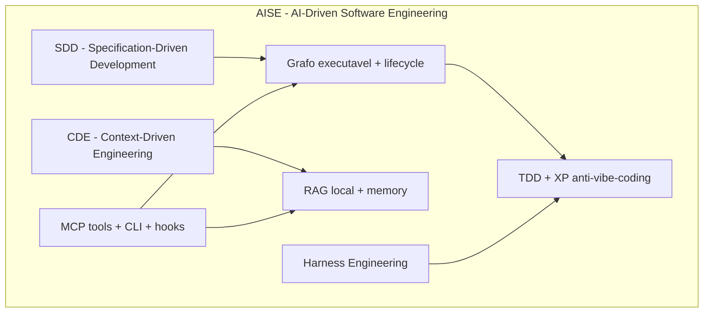
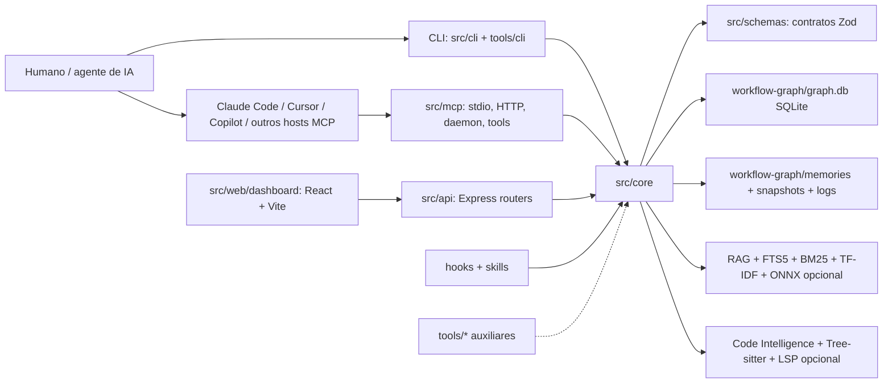
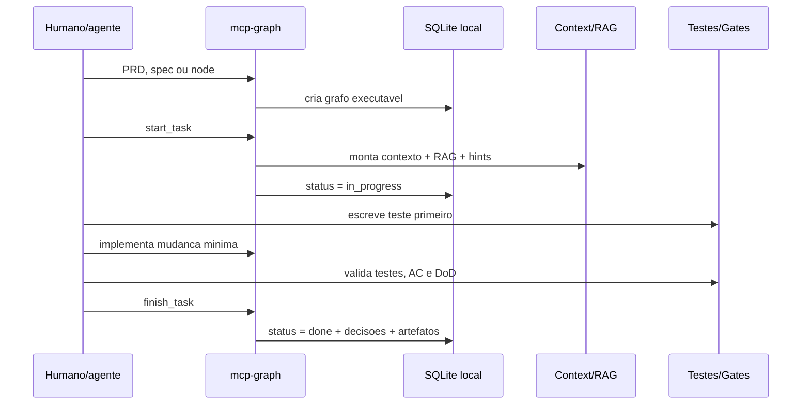
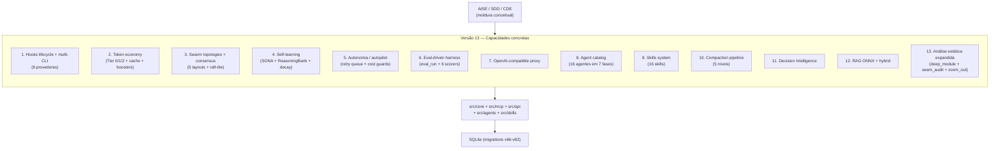

# Arquitetura local do mcp-graph

Este documento delimita a arquitetura local do `mcp-graph` e o vocabulario
metodologico usado pelo projeto. A leitura principal e: **AISE e o circulo
maior**, e dentro dele o `mcp-graph` combina **SDD** para transformar intencao
em execucao rastreavel e **CDE** para manter contexto util entre sessoes de IA.

O escopo aqui e o produto principal publicado pelo pacote
`@mcp-graph-workflow/mcp-graph`, os workspaces oficiais e as ferramentas
auxiliares mantidas neste repositorio. Diretorios externos, forks locais e
spikes aparecem apenas como referencias locais quando influenciam uma decisao.

## Mapa Conceitual

**AISE** e a borda externa: engenharia de software dirigida por IA, com agente
assistindo ou executando trabalho, mas sob disciplina explicita. No
`mcp-graph`, AISE nao significa "pedir codigo para uma IA"; significa operar
um ciclo onde especificacao, contexto, testes, decisoes, tarefas e validacao
ficam persistidos e auditaveis.

## Disciplinas

| Disciplina | Escopo no mcp-graph | Fora de escopo |
|---|---|---|
| **AISE** | Categoria do sistema: software entregue com agentes de IA, governanca por grafo, TDD, contexto persistente e gates. | Uso solto de chatbots, vibe-coding, prompts sem rastreabilidade. |
| **SDD** | PRD, requisitos, criterios de aceite, contratos, cenarios, decisoes e tasks viram artefatos executaveis no grafo. | Documento estatico que apenas inspira implementacao e fica obsoleto. |
| **CDE** | Engenharia do contexto: graph context, RAG, memories, docs cache, code intelligence, citacoes e orcamento de tokens. | Colar arquivos enormes no prompt ou depender da memoria volatil do chat. |
| **TDD / XP** | Teste antes da implementacao, tasks atomicas, Red-Green-Refactor, WIP baixo, anti-one-shot. | Implementar primeiro e testar apenas se sobrar tempo. |
| **Harness Engineering** | Medir agent-readiness: tipos, testes, arquitetura, docs, nomes, erros, contexto e proveniencia. | Metrica generica de qualidade ou substituto de seguranca. |
| **Lifecycle / Gates** | 9 fases com pre-requisitos, DoD, validacao e transicoes rastreadas. | Checklist manual desconectado do estado real do projeto. |
| **MCP** | Interface padronizada para agentes acessarem ferramentas locais do `mcp-graph`. | Backend SaaS obrigatorio ou dependencia de LLM especifica. |

### SDD

**Specification-Driven Development** e a parte em que a intencao vira estrutura
executavel. O `mcp-graph` recebe PRDs, specs e documentos, extrai requisitos,
decompoe trabalho em nodes, associa criterios de aceite e mantem o plano em
SQLite. A especificacao dirige implementacao, validacao e evolucao.

No `mcp-graph`, SDD aparece em:

- `import_prd`, `spec`, `spec_sync`, `node`, `edge`, `template` e
  `constitution`.
- Nodes de tipo `epic`, `requirement`, `task`, `contract`, `scenario`,
  `decision`, `acceptance_criteria` e similares.
- Criterios de aceite testaveis, Definition of Ready, Definition of Done e
  phase gates antes de transicoes relevantes.
- ADRs, contratos e decisoes no grafo, nao como notas paralelas.

### CDE

**Context-Driven Engineering** e a disciplina local do projeto para projetar,
persistir e recuperar o contexto que torna agentes uteis entre sessoes. Todo
contexto relevante deve ser recuperavel a partir de grafo, RAG, memories,
codigo indexado, historico de decisoes, documentos, telemetria local e
citacoes.

No `mcp-graph`, CDE aparece em:

- `context`, `search`, `knowledge`, RAG hibrido, memories e caches semanticos.
- Indexadores de docs, PRD, memory, code context, decisoes, WSDL, Journey,
  Siebel, Translation e skills.
- Compressao por orcamento de tokens, boost por fase, BM25/TF-IDF, embeddings
  opcionais via ONNX e rastreabilidade de citacoes.
- Separacao entre memoria point-in-time e estado real do codigo.

## Core vs Auxiliar vs Externo

| Classe | O que inclui | Regra de leitura |
|---|---|---|
| **Core** | Codigo publicado no pacote principal e usado no fluxo regular: `src/core`, `src/mcp`, `src/api`, `src/cli`, `src/web/dashboard`, `src/schemas`, `.agents/skills`. | E arquitetura do produto. Divergencias devem ser resolvidas no core e expostas por MCP/CLI/API. |
| **Auxiliar oficial** | Ferramentas mantidas no repo que suportam LLM, analise, experimentos ou distribuicao: `tools/cli`, `tools/copilot-bridge`, `tools/copilot-bridge-cli`, `tools/feature-depth`, `tools/h9v2-pilot`, `presentation/dist`. | Pode ser documentado como suporte oficial, mas nao deve ser confundido com dominio central. |
| **Externo / vendored / spike** | `browser-use-main`, `hermes-agent-main`, `sdk`, `skills-graph` e outros diretorios locais ignorados ou usados como referencia. | Nao sao core; servem para comparacao, auditoria, exemplos ou integracao pontual. |

## Mapa Por Camadas

### Produto Principal

| Camada | Diretorios | Responsabilidade |
|---|---|---|
| Contratos | `src/schemas/` | Schemas Zod para graph, nodes, edges, lifecycle, security, harness, browser pilot, Journey, Siebel, agents, skills, plugins, presets e specs. |
| Dominio | `src/core/` | Regras de negocio: graph/store, lifecycle, planner, implementer, validator, reviewer, deployer, listener, analyzer, designer, RAG, knowledge, docs, parser, importer, code intelligence, harness, browser harness, security, sandbox, hooks, provenance e observability. |
| Contexto e conhecimento | `src/core/context`, `src/core/rag`, `src/core/knowledge`, `src/core/memory`, `src/core/docs`, `src/core/citations` | Context assembly, RAG multi-estrategia, docs cache, Context7 MCP fetcher, citacoes, decision provenance, token budgeting, semantic cache e memories. |
| Inteligencia de codigo | `src/core/code`, `src/core/lsp`, `src/core/translation` | Code graph, impacto, Tree-sitter, LSP opcional, traducao entre linguagens, UCR, geradores e validadores. |
| Integracoes de dominio | `src/core/siebel`, `src/core/davinci`, `src/core/journey`, `src/core/swarm`, `src/core/kanban`, `src/core/dream` | Capacidades especializadas para Siebel SIF/WSDL, DaVinci plugins, Journey runs, Swarm, Kanban e Dream flows. |
| LLM e automacao | `src/core/llm`, `src/core/proxy`, `src/core/browser-harness`, `src/core/browser-pilot`, `src/core/autonomy`, `src/core/economy` | Gateway/failover de LLM, proxy OpenAI-compatible, Playwright/browser-use style automation, browser harness, autonomia e economia de tokens/cache. |
| MCP | `src/mcp/` | Registro de ferramentas MCP, contratos, transports stdio/HTTP, daemon, proxy e wrappers para `start_task`, `finish_task`, `context`, `knowledge`, `validate`, `swarm`, `translate`, `journey`, `siebel`, `davinci` e demais tools. |
| API | `src/api/` | Express routers para dashboard e automacoes: graph, nodes, edges, search, context, RAG, knowledge, harness, browser-harness, autonomy, Journey, Siebel, Translation, Dream, DaVinci, Kanban, agents, logs e SSE. |
| CLI | `src/cli/` | Entradas publicadas do pacote principal, comandos e bootstrap que delegam ao core e MCP. |
| Dashboard | `src/web/dashboard/` | UI React/Vite para grafo, contexto, code graph, benchmark, insights, harness, logs, Journey e operacoes via API. |
| Skills e hooks | `.agents/skills/`, `src/core/hooks`, `src/skills`, `src/browser-harness-skills` | Workflows de agente, detectores, regras operacionais, skills de dominio e helpers de browser harness. |

### Workspaces

O `package.json` raiz declara dois workspaces oficiais:

- `tools/cli`: CLI REPL-first, privada, empacotada com esbuild e copiada
  para o pacote principal. Ver "Versão 13 — Highlights" para o que entrou
  nesta linha.
- `src/web/dashboard`: dashboard Vite/React construido junto ao pacote e
  copiado para `dist/web/dashboard/dist`.

### Ferramentas Auxiliares Oficiais

| Ferramenta | Papel |
|---|---|
| `tools/cli` | Superficie humana moderna (`mg`), REPL, hooks, lifecycle, login Copilot e comandos de inicializacao. |
| `tools/copilot-bridge` | Extensao VS Code que expoe GitHub Copilot via API REST OpenAI-compatible/Anthropic-compatible para browser automation e agentes locais. |
| `tools/copilot-bridge-cli` | CLI standalone `mcp-graph-bridge` que expoe GitHub Copilot sem depender do VS Code. |
| `tools/feature-depth` | Analyzer em Go para profundidade de features e sinais de arquitetura/qualidade usados como suporte de roadmap e analise. |
| `tools/h9v2-pilot` | Piloto experimental com OpenRouter para avaliar arms, custos, gates e extracao. |
| `presentation/dist` | Site/apresentacao estatica distribuivel com imagens do produto e narrativa publica. |

### Estado Local

`workflow-graph/` e estado operacional local e normalmente gitignored. Ele
abriga:

- `graph.db`, `graph.db-wal` e `graph.db-shm`: SQLite local com nodes, edges,
  knowledge, logs, metrics, snapshots e artefatos persistidos.
- `memories/`: snapshots narrativos point-in-time, nunca fonte live de
  progresso.
- `snapshots/`, `models/`, caches, traces, debug output e logs quando
  habilitados por ferramentas especificas.
- Arquivos de autenticacao/configuracao locais como tokens de bridge ou
  artefatos de harness, quando o usuario opta por integracoes externas.

## Stack Tecnologico

| Area | Tecnologia |
|---|---|
| Linguagem e runtime | TypeScript, ESM, Node.js >=20. |
| Build e empacotamento | `tsup` sobre esbuild para bins principais; esbuild direto no workspace CLI; scripts de copia para assets, grammars e dashboard. |
| CLI | Commander, Ink, React, chalk, Clack prompts e comandos `mg`/`mcp-graph`. |
| MCP | `@modelcontextprotocol/sdk`, transports stdio, Streamable HTTP, daemon/socket transport e profile/taxonomy de tools. |
| API realtime | Express, middleware local, WebSocket via `ws` onde necessario e SSE em `/api/v1/events`. |
| Dashboard | React, Vite, Tailwind, React Flow (`@xyflow/react`), Sigma, Graphology, Dagre, Recharts e Lucide. |
| Persistencia | SQLite via `better-sqlite3`, migrations, stores e estado local em `workflow-graph/`. |
| Busca e RAG | SQLite FTS5, BM25, TF-IDF, query understanding, post-retrieval, semantic cache, ONNX optional (`onnxruntime-node`) e vector/embedding stores. |
| Code intelligence | Tree-sitter nativo e web-tree-sitter, parsers por linguagem, LSP opcional (`typescript-language-server`, `intelephense`) e grafo de dependencias. |
| Parsers e importacao | PDF (`pdf-parse`), DOCX (`mammoth`), HTML (`cheerio`), XML/WSDL/SIF (`fast-xml-parser`), ZIP (`adm-zip`), YAML e OCR/Tesseract (`tesseract.js`). |
| Automacao browser | Playwright, browser harness local, browser-use MCP como integracao externa, plan-payload UI validation e screenshots/Journey runs. |
| Docs externas | Context7 MCP para cache/sync de documentacao de bibliotecas quando configurado. |
| LLM/proxy | GitHub Copilot Bridge, proxy OpenAI-compatible, adapters/failover locais e piloto OpenRouter em `tools/h9v2-pilot`. |
| Testes | Vitest, Testing Library, jsdom, Supertest e Playwright para E2E. |
| Governanca | Lifecycle gates, security scanner, harness scan, provenance, hooks, sandbox, citations e audit trail. |

## Fluxo Operacional

O ciclo completo e:

1. **ANALYZE**: transformar ideia/PRD em requisitos, riscos e criterios.
2. **DESIGN**: registrar arquitetura, contratos e ADRs.
3. **PLAN**: decompor em tasks atomicas, estimar e ordenar dependencias.
4. **IMPLEMENT**: executar `start_task`, TDD e implementacao minima.
5. **VALIDATE**: validar ACs, cenarios, regressoes e harness.
6. **REVIEW**: avaliar blast radius, qualidade, seguranca e documentacao.
7. **HANDOFF**: preparar entrega, PR, memoria e snapshot.
8. **DEPLOY**: validar release e readiness.
9. **LISTENING**: coletar feedback e alimentar o proximo ciclo.

## Fronteiras Importantes

- **Grafo vence memoria**: memories sao snapshots; o estado real vem do codigo
  e de `workflow-graph/graph.db`.
- **Core vence superficie**: se CLI, MCP, API e dashboard divergem, a regra
  deve ser corrigida no `src/core` e exposta de forma consistente.
- **Schemas sao base**: `src/schemas` define contratos compartilhados e nao
  deve depender de `core`, `mcp`, `api` ou `cli`.
- **Local-first por padrao**: SQLite, RAG, busca e memories funcionam sem SaaS
  obrigatorio; Copilot, OpenRouter, Context7, browser-use e outros provedores
  externos sao opt-in.
- **Seguranca nao e harness**: Harness mede readiness para agentes; seguranca e
  gate paralelo.
- **Auxiliar nao e core**: Copilot Bridge, feature-depth, H9v2 pilot e
  apresentacao sao oficiais, mas suportam o produto em vez de definir seu
  dominio central.
- **Externo nao e arquitetura principal**: `browser-use-main`,
  `hermes-agent-main`, `sdk` e `skills-graph` nao entram no mapa core.
- **TDD nao e sugestao**: durante implementacao, node existente e fluxo
  `start_task -> teste -> implementacao -> finish_task` sao obrigatorios.

## Versão 13 — Highlights

A v13 é a primeira release que materializa em código a moldura conceitual
descrita acima. AISE/SDD/CDE seguem como abertura estável; as 13 capacidades
abaixo são instâncias concretas dessa moldura, organizadas por domínio.
Cada item lista os módulos-chave (já presentes em "Mapa Por Camadas") e a
função operacional que cumprem.

### 1. Hooks lifecycle + multi-CLI

`src/core/hooks/` (37 módulos) entrega os 12 canais do lifecycle (`session:*`,
`agent:*`, `task:*`, `tool:*`, `memory:*`, `swarm:consensus-reached`) com bus,
registry, matcher (`<channel>(<key>:<glob>)`), persistência 3-tier
(`~/.mcp-graph/hooks.json`, `<repo>/.mcp-graph/hooks.json`, `*.local.json`),
sandbox `kind=shell|module|mjs-module|inline-unsafe` (legacy gated por
`MCP_GRAPH_HOOKS_INLINE_UNSAFE`), dedup-store (200ms window) entre MCP e
fs-watcher, e graph-event-bridge opt-in. Importadores em
`src/core/hooks/providers/` cobrem 8 CLIs: Claude Code (alias map +
PreToolUse/PostToolUse/SessionStart/etc), Codex (TOML), OpenCode (TOML +
plugin discovery), Copilot CLI (.mjs extensions), Cursor / Continue / Cline
(MCP-only via fs-watcher), Aider (gerador de `.git/hooks/{pre-commit,pre-push}`).
Observabilidade per-handler (call_count, p50/p95, last_error,
circuit_state) em `hook_handler_stats`.

### 2. Token economy

`src/core/llm/{tier-router,complexity-classifier,intent-classifier,
response-cache,batch-coalescer,booster-runner}.ts` + 6 boosters em
`src/core/llm/boosters/` (`var-to-const`, `add-types`, `add-error-handling`,
`async-await`, `add-logging`, `remove-console`). Tier 0 (boosters regex /
zero LLM, <1ms, $0) → Tier 1 (Haiku para budget pequeno, Sonnet a partir de
8k tokens) → Tier 2 (Opus para gates críticos). `ResponseCache` LRU +
SQLite TTL com auto-invalidação por schemaVersion. Batch coalescer com
janela 50–200ms agrupa N chamadas independentes. `src/core/economy/`
fornece cache-key sha256 (model + canonical_json(args) + schemaVersion),
economy-types Zod e allowlist `_cacheable-tools.ts` (mutating tools nunca
cacheiam). Composição multiplicativa com tiered-context: ~30–50% adicional
sobre os 73% existentes.

### 3. Swarm coordination

`src/core/swarm/topologies/{hierarchical,mesh,ring,star,pipeline}.ts`
implementam layouts puros (sem I/O) que o `swarm-coordinator` instancia.
`hierarchical` (queen + workers, fan-out/fan-in), `mesh` (peer-to-peer com
`hasNoSpof` predicate, edgeCount = N(N-1)), `ring` com `runRingPipeline`
(stage failure isolada, subsequent stages não invocados), `star` com
`runStarBroadcast` + `StarHubError` typed. Consenso em
`src/core/swarm/consensus/`: `majority` (quorum > N/2) + `raft-lite`
(leader election <100ms, log replication <50ms, heartbeat-timeout
re-election). `a2a-mailbox.ts` é um ring buffer de 100 mensagens por
recipient com status pending → delivered → acked. `judge-monitor.ts` e
`agent-claim-manager.ts` cuidam de stall detection e atomic claim. Gated
por `MCP_GRAPH_MULTIAGENT=on` (default off, single-agent path intocado).

### 4. Self-learning

`src/core/learning/{sona-router,reasoning-bank,performance-tracker,decay,
routing-strategy,learning-actions}.ts`. SONA = kNN routing sobre PerfRecord
com cold-start fallback (MIN_SAMPLES_FOR_KNN). ReasoningBank persiste
trajectories no padrão RETRIEVE → JUDGE → DISTILL e recall por Jaccard.
`decay.ts` aplica esquecimento de Ebbinghaus (`exp(-Δt/τ)`, τ default 30
dias). `delegate(routingStrategy: manual|sona|hybrid)` — manual preserva
comportamento pré-E5 e é o default. Migration v68 cria `agent_performance`
+ `reasoning_trajectories`.

### 5. Autonomia / autopilot

`src/core/autonomy/` (23 módulos). Scheduler + `retry-worker` (loop a cada
30s sobre `retry_queue` persistente em SQLite) + `event-reactor` para 5
canais críticos (`cost:budget_exceeded` → pause; `task:error` → enqueue;
`harness:regression` → pause; `session:start` → resume snapshot;
`error:retry_exhausted` → escalate). `cost-fallback` engaja Haiku em >80%
do cap; `cost-runaway-guard` pausa autopilot. `autonomic-scaling` escala
agent pool por xpSize; `backpressure-detector` segura dispatch quando
WIP excede capacidade. `auto-approval-policy` + `risk-classifier`
auto-aprovam ACs trivial+low quando confidence >95%. `lessons-store`
persiste padrões de falha e alimenta o steering loop. Tudo gated por
`MCP_GRAPH_AUTONOMY=on`; bootstrap em `autonomy-bootstrap.ts` +
`daemon-autonomy-wiring.ts`.

### 6. Eval-driven harness

`src/core/evals/{eval-runner,empirical-model-hint,evals-summary,
propose-as-golden}.ts` + 6 scorers em `src/core/evals/scorers/` (`exact`,
`regex`, `ac-quality`, `citation-coverage`, `embedding-cosine`,
`llm-judge`). Migration v71 cria `eval_golden` (input, expected,
scorer_kind, tool, project_id, metadata, tags) + `eval_run` (run_id,
golden_id, score, passed, latency_ms, model_used, cost_usd).
`computeEmpiricalModelHint(runs, {tool, limit:50})` lê as últimas N rows
e injeta `empiricalOverride` em `task-readiness-score.ts`: quando
`basedOn >= MIN_EMPIRICAL_SAMPLES` (5), o pass-rate empírico vence a
heurística xpSize/AC/depth. Surface REST em `/api/evals/summary`
(passRate, totalCostUsd, trend, topFailing).

### 7. OpenAI-compatible proxy

`src/core/proxy/{server,bearer-token,openai-shape}.ts` expõe `GET /healthz`
(no auth), `POST /v1/chat/completions` (OpenAI-shape, non-streaming) e
`GET /v1/models`. Bind exclusivamente em 127.0.0.1; bearer obrigatório
salvo no token file modo 0600 com rotação preservando o token anterior
em grace-window (`proxy-cli-actions.ts`). Header `X-MCP-Graph-Caller`
identifica o consumidor (browser-use, copilot-vscode, continue, cline)
e o `llm_call_ledger` (migration v70) registra `caller`, `cell_id`,
`run_id`, `cost_usd`, `latency_ms` por chamada.

### 8. Agent catalog (16 agentes em 7 fases)

`src/agents/{ANALYZE,DESIGN,PLAN,IMPLEMENT,VALIDATE,REVIEW,HANDOFF}/*.md`
com frontmatter Zod-validado (`AgentDefinitionSchema`) e carregado por
`agent-loader.ts`. Catálogo: ANALYZE (`prd-analyst`,
`requirement-decomposer`), DESIGN (`architect`, `adr-author`), PLAN
(`sprint-planner`, `dependency-mapper`), IMPLEMENT (`coder`, `tester`,
`pair-driver`, `hierarchical-coordinator`, `mesh-coordinator`), VALIDATE
(`qa-validator`, `ac-checker`), REVIEW (`code-reviewer`,
`harness-auditor`), HANDOFF (`documenter`, `release-notes-writer`).
`agent-pool.ts` faz pre-spawn com lease + heartbeat para reuso entre
tarefas.

### 9. Skills system

`src/skills/{analyze,design,plan,implement,validate,review,domain,any}/*.md`
— 16 skills reusáveis indexáveis por descrição semântica:
`decompose-prd`, `grill-me`, `design-an-interface`, `seam-audit`,
`plan-sprint`, `budget-aware-picking`, `tracer-bullet-tdd`,
`anti-hallucination`, `pure-decision-pattern`, `dod-checklist`,
`harness-regression-check`, `citation-coverage-review`,
`deep-module-review`, `lessons-consult`, `code-detachment`, `wip-one`.
Suportadas por `src/core/skills/{skill-registry,skill-scaffolder,
trajectory-analyzer}.ts` + tool `manage_skill`.

### 10. Compaction pipeline 5-level

`src/core/context/{compaction-pipeline,microcompaction,spillover,
llm-summarizer,emergency-summarizer,compaction-circuit-breaker}.ts`.
Escalonamento: `none` (cabe no target) → `micro` (dedup adjacent
`tool-result` duplicates) → `spillover` (fold older into single summary
line, preserva últimas N) → `llm` (summarizer com budget gate) →
`emergency` (truncate keepLast). Circuit breaker bloqueia loops
patológicos. Resultado expõe `metrics.{tokensBefore,tokensAfter,
levelUsed,levelsTried,durationMs}`.

### 11. Decision Intelligence

`src/core/decisions/decisions-store.ts` (migration v80 cria tabela
`decisions`) registra cada decisão como `intent`, `options[]`, `chosen`,
`reasoning`, `outcome`. Complementa `IssuePatternTracker` no steering
loop e alimenta o `lessons-store` da autonomia. Tool `delegate(action:
"complete")` indexa rationale via `finish_task` para futura RAG.

### 12. RAG ONNX + hybrid

`src/core/rag/{rag-hybrid-mode,hybrid-search,sufficiency-check,
iterative-deepening,memory-gap-detector,model-downloader,
embedding-cache,onnx-embeddings,tensor-buffer-pool}.ts`.
`MCP_GRAPH_EMBEDDINGS=tfidf|onnx` (alias) ou `RAG_HYBRID_MODE=lexical|hybrid`
(canonical). ONNX MiniLM-L6-v2 quantizado (~22MB, 384-dim) com lazy init,
SHA256 verify, `downloadIfMissing` (cache + partial-fail cleanup +
resume), tensor buffer pool zero-alloc por chamada,
`EmbeddingCache` LRU sha256-keyed com hits/misses/hitRate stats.
`hybrid-search` combina BM25 + cosine com MMR re-ranking;
`sufficiency-check` flag baixa cobertura para iterative-deepening
(synonyms + broader context); `memory-gap-detector` sinaliza termos
sem cobertura no knowledge store.

### 13. Análise estática expandida

`src/core/analyzer/{deep-module,seam-audit,zoom-out}.ts` adicionam três
modes ao `analyze()`: `deep_module` (camadas internas de um módulo),
`seam_audit` (interfaces entre módulos), `zoom_out` (visão high-level
do grafo). Compõem com os modes existentes (harness_scan,
implement_done, ready, validate_ready, review_ready, etc.).

### Migrations introduzidas (v66-v82)

| Versão | O que cria |
|---|---|
| v66 | `knowledge_docs` project index (FTS5 multi-project) |
| v67 | embeddings: `embedding_blob` (BLOB) + `vector_dim` (ONNX) |
| v68 | Self-learning: `agent_performance` + `reasoning_trajectories` |
| v69 | Hooks: `hook_handlers` + `hook_handler_stats` |
| v70 | LLM failover: `llm_call_ledger` (provider_used + fallback_count) |
| v71 | Evals: `eval_golden` + `eval_run` |
| v73 | A2A: `a2a_mailbox` |
| v76 | Autonomia: `retry_queue` (persistent retry) |
| v77 | Autonomia: `error_patterns` (adaptive retry) |
| v78 | Autonomia: `lessons_learned` |
| v80 | Decision Intelligence: `decisions` |
| v82 | Token economy: response cache + `economy_metrics` |

## Referencias

- [`README.md`](../README.md): posicionamento AISE, SDD e CDE do projeto.
- [`CLAUDE.md`](../CLAUDE.md): convencoes de arquitetura, stack e qualidade.
- [`docs/reference/LIFECYCLE.md`](reference/LIFECYCLE.md): ciclo de 9 fases e gates.
- [`docs/_internal/adr/0057-local-first-zero-saas.md`](_internal/adr/0057-local-first-zero-saas.md): decisao local-first e zero SaaS obrigatorio.
- [GitHub Spec Kit](https://github.github.io/spec-kit/): referencia externa para Specification-Driven Development.
- [DORA 2025 State of AI-assisted Software Development](https://dora.dev/dora-report-2025/): IA como amplificador de capacidades organizacionais.
- [Model Context Protocol](https://modelcontextprotocol.io/): protocolo aberto para conectar aplicacoes e contexto a LLMs.
- `docs/_internal/prd/HOOKS-INTEGRATION-PRD.md` (interno, gitignored): hooks
  lifecycle 12 canais e sandbox.
- `docs/_internal/prd/HOOKS-MULTI-CLI-INTEGRATION-PRD.md` (interno,
  gitignored): provedores Codex/OpenCode/Copilot/Cursor/Aider/Continue/Cline.
- `docs/_internal/prd/SKILLS-HIVE-INTEGRATION-PRD.md` (interno, gitignored):
  skills system + agent catalog + compaction pipeline.
- `docs/_internal/prd/RUFLO-INTEGRATION-PLAN.md` (interno, gitignored):
  origem do EPIC 6 token economy (booster + cache + tier router).
