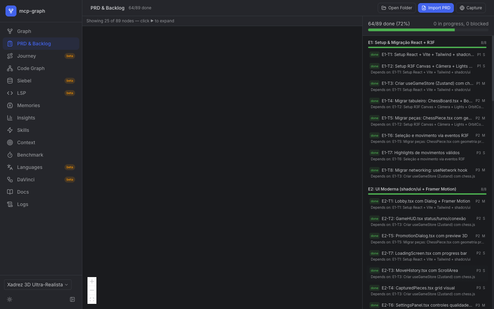
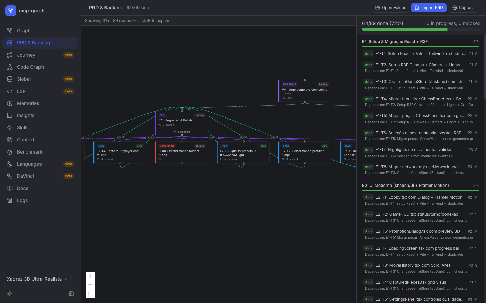
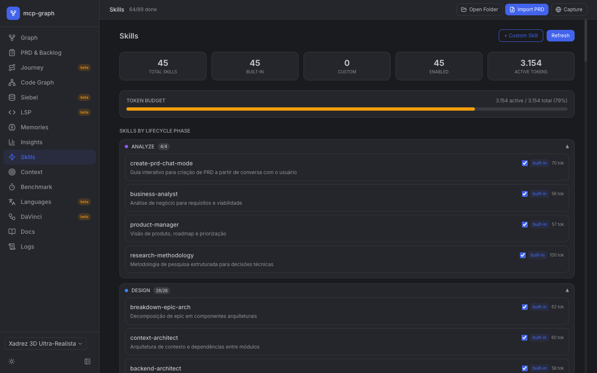
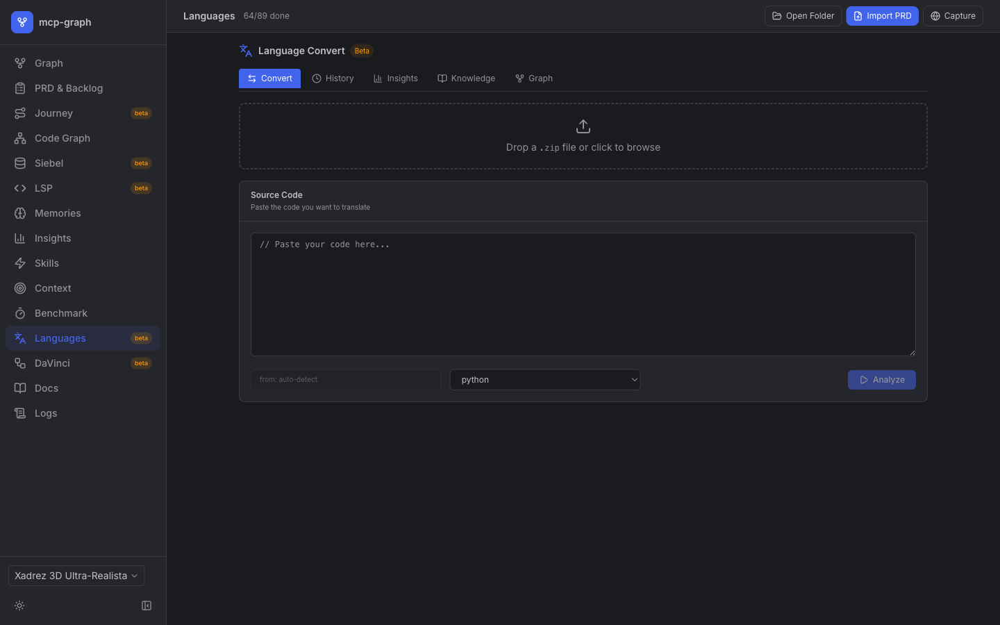
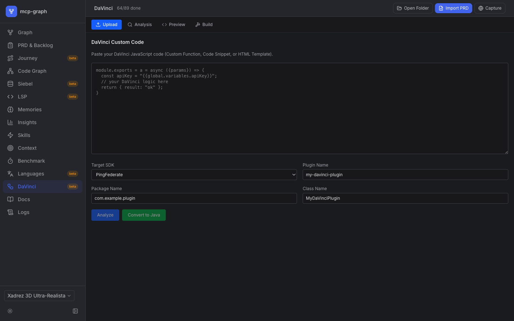
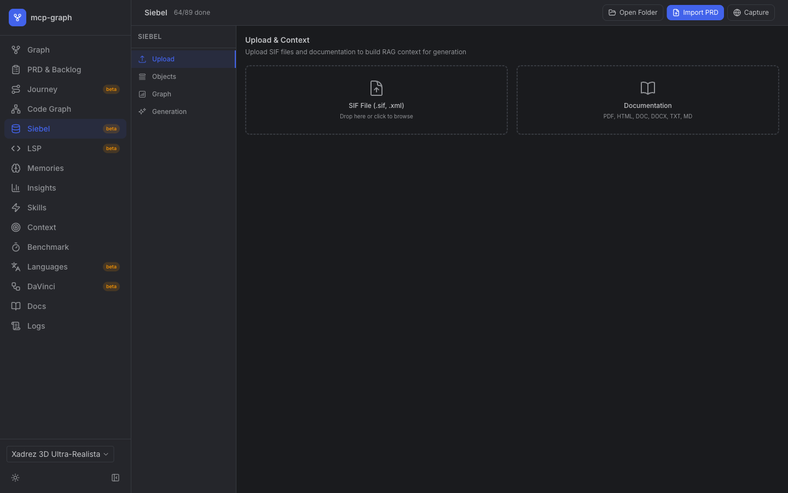
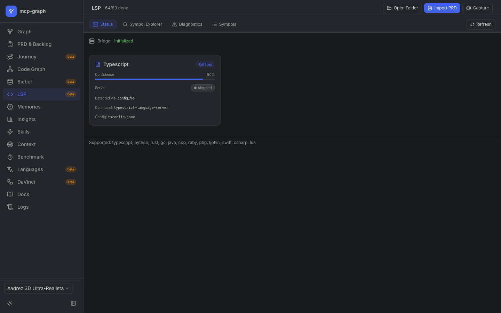
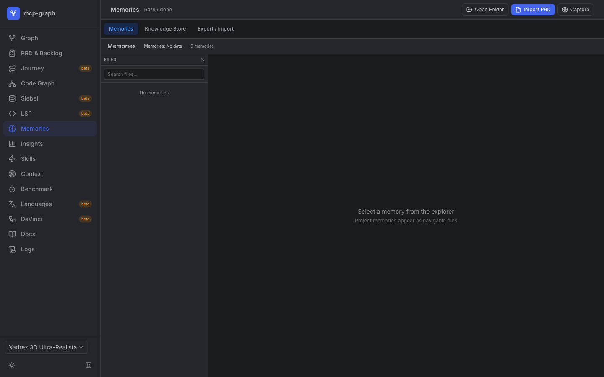
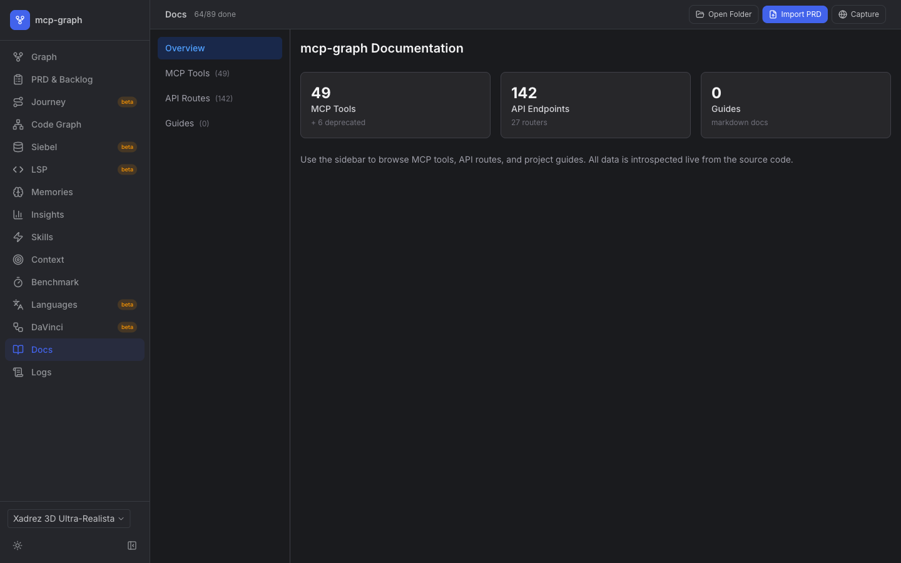
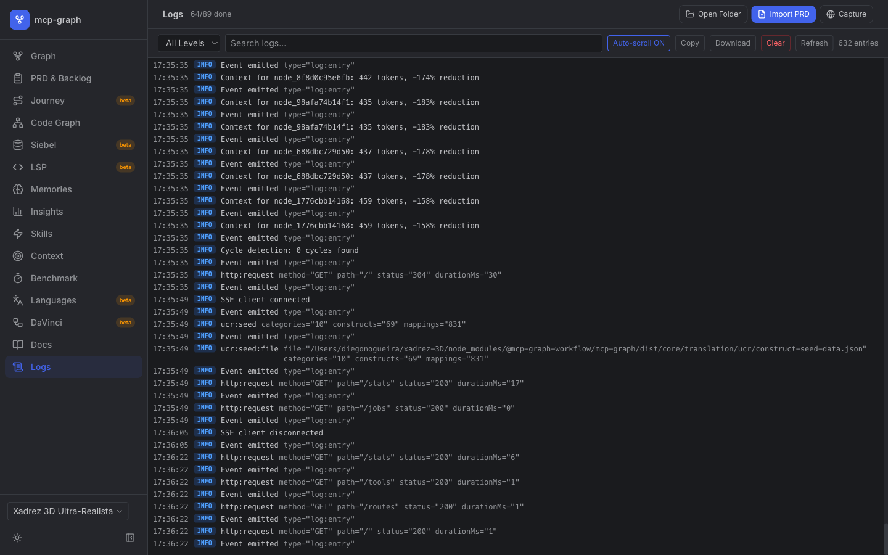

# mcp-graph v6.0 Features Guide

> **Historical:** This guide describes v6.0 features. The current version is v8.0. See README.md for the latest.

This guide covers all 8 features introduced in v6.0. Zero breaking changes — all v5.x tools continue working.

## Dashboard Overview

The mcp-graph dashboard provides 15 tabs for complete project visibility:

### Graph — Interactive execution graph with hierarchy, filters, and node table


### PRD & Backlog — Progress tracking with dependency visualization


### Journey — Website journey mapping with milestone tracking


### Code Graph — Multi-language code intelligence (221 symbols, 177 relations)


### Insights — Health score, status distribution, sprint progress, knowledge coverage


### Skills — 45 built-in skills mapped to 9 lifecycle phases with token budget


### Context — Token management, DreamMode (NREM→REM→Wake), session health


### Benchmark — 97% compression rate, cost impact per model, token usage per tool


### Languages — Code translation between 13 languages with construct analysis


### DaVinci — DaVinci JS to PingAccess/PingFederate Java plugin converter


### Siebel — SIF import/export, object browser, code generation


### LSP — Language Server Protocol status, symbol explorer, diagnostics


### Memories — Project knowledge store with export/import


### Docs — Live-introspected MCP tools, API routes, and guides


### Logs — Real-time structured logs with filtering and search


---

## 1. Pipeline Tools (`start_task` / `finish_task`)

### Problem
The mandatory workflow required 6 tool calls per task: `next → context → rag_context → [implement] → analyze(implement_done) → update_status`. With 20 tasks per sprint, that's 120 overhead calls.

### Solution
Two compound tools that compose existing functions into single calls:

#### `start_task`
Composes: `next` + `context` + `rag_context` + TDD hints + `update_status(in_progress)`

```json
{
  "nodeId": "optional — specific task or auto via next",
  "contextDetail": "summary | standard | deep",
  "ragBudget": 4000,
  "autoStart": true
}
```

Returns: task + context + ragContext + tddHints + startedAt

#### `finish_task`
Composes: DoD (9 checks) + AC validation + `update_status(done)` + epic promotion + `next`

```json
{
  "nodeId": "task-id",
  "rationale": "Decision captured as AI decision for future RAG",
  "testFiles": ["src/tests/feature.test.ts"],
  "autoNext": true
}
```

Returns: dodReport + status (done|blocked) + blockers + epicPromotion + nextTask

### Example Flow

```
start_task()
→ { task: "Implement login", tddHints: ["should return JWT on valid credentials"], startedAt: "..." }

# Agent implements with TDD...

finish_task({ nodeId: "...", rationale: "Used JWT for stateless auth", testFiles: ["src/tests/login.test.ts"] })
→ { status: "done", dodReport: { grade: "A", score: 92 }, nextTask: { title: "Implement logout" } }
```

---

## 2. Agent State Machine (`nextAction`)

### Problem
Agents decide what to call next → frequent mistakes (wrong tool, wrong phase, missing validations).

### Solution
Every tool response includes `_lifecycle.nextAction`:

```json
{
  "_lifecycle": {
    "phase": "IMPLEMENT",
    "nextAction": {
      "tool": "start_task",
      "reason": "Task done — start next task",
      "priority": "recommended",
      "hint": "Next unblocked task with highest priority"
    }
  }
}
```

### State Transition Table

| After tool | nextAction | Priority |
|-----------|-----------|----------|
| `start_task` | (agent implements) | — |
| `finish_task` (pass) | `start_task` | recommended |
| `finish_task` (fail) | fix blockers | required |
| `import_prd` | `analyze(prd_quality)` | recommended |
| `plan_sprint` | `sync_stack_docs` | recommended |
| `sync_stack_docs` | `start_task` | recommended |
| `update_status(done)` | `start_task` | recommended |
| `set_phase(VALIDATE)` | `validate(ac)` | recommended |

---

## 3. DORA Metrics & Forecast

### Usage

```
forecast({ mode: "dora" })
```

### Metrics

| Metric | What it measures | Target |
|--------|-----------------|--------|
| **Deployment Frequency** | Tasks done per day (rolling 7d) | > 2/day (Elite) |
| **Lead Time** | Created → done (P50/P85/P95 hours) | P85 < 24h (Elite) |
| **Change Failure Rate** | Status reversals / total done | < 5% (Elite) |
| **MTTR** | Rework detection → resolution (hours) | < 1h (Elite) |
| **Trend** | Comparing last 7d vs previous 7d | improving/stable/declining |

---

## 4. Cross-Project Learning

### Usage

```
learn_from_project({
  sourcePath: "/path/to/other-project/workflow-graph/graph.db",
  categories: ["errors", "estimates", "adrs"],
  minQuality: 0.4,
  maxDocs: 100
})
```

### Categories

| Category | Source types imported |
|----------|---------------------|
| `errors` | AI decisions, validation results, test outcomes |
| `estimates` | Sprint plans, phase summaries |
| `adrs` | AI decisions, design docs |
| `templates` | Skills, PRDs |
| `patterns` | Memories, syntheses, AI decisions |

Knowledge is deduplicated by content hash — importing the same docs twice is safe.

---

## 5. Code-Aware Graph Sync

### Usage

```
analyze({ mode: "code_sync" })
```

### What it detects

- **Stale sourceRefs** — nodes referencing deleted/moved files
- **Missing testFiles** — done tasks without test file references
- **Symbol drift** — code index git hash for staleness detection

---

## 6. Smart Decompose

### Usage

```
analyze({ mode: "smart_decompose", nodeId: "task-id" })
```

### Rules

- **1 AC = 1 subtask** — each acceptance criterion becomes a separate subtask
- **Test type inference** — keywords determine unit/integration/e2e
- **Sequential dependencies** — subtasks depend on previous ones

### Test Type Inference

| Keywords | Type |
|----------|------|
| api, endpoint, database, persists, saves, sync, fetch, http | integration |
| page, click, browser, redirect, ui, dashboard, form, button | e2e |
| Everything else | unit |

---

## 7. Cumulative Flow Diagram (CFD)

### Usage

```
analyze({ mode: "cfd" })
```

Captures a daily snapshot of node status distribution (backlog/ready/in_progress/blocked/done) and returns time-series data for flow analysis.

### Migration v26

Adds `flow_snapshots` table to SQLite. Applied automatically on first use.

---

## 8. Template & Documentation Updates

The `init` command now generates CLAUDE.md and copilot-instructions.md with:

- **Pipeline v6.0 flow** as the recommended workflow
- **48 documented analyze modes** (was 24)
- **Industrial methodology principles** (Little's Law, Six Sigma, DORA, Shift-Left)
- **Definition of Ready** (7 checks) and **Definition of Done** (9 checks)
- **Phase Gates** — what to run before each lifecycle transition
- **Agent antipatterns** — common mistakes and corrections

Use `help(topic: "pipeline")` for on-demand reference.
