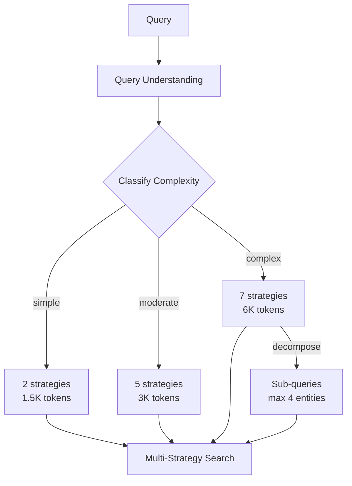
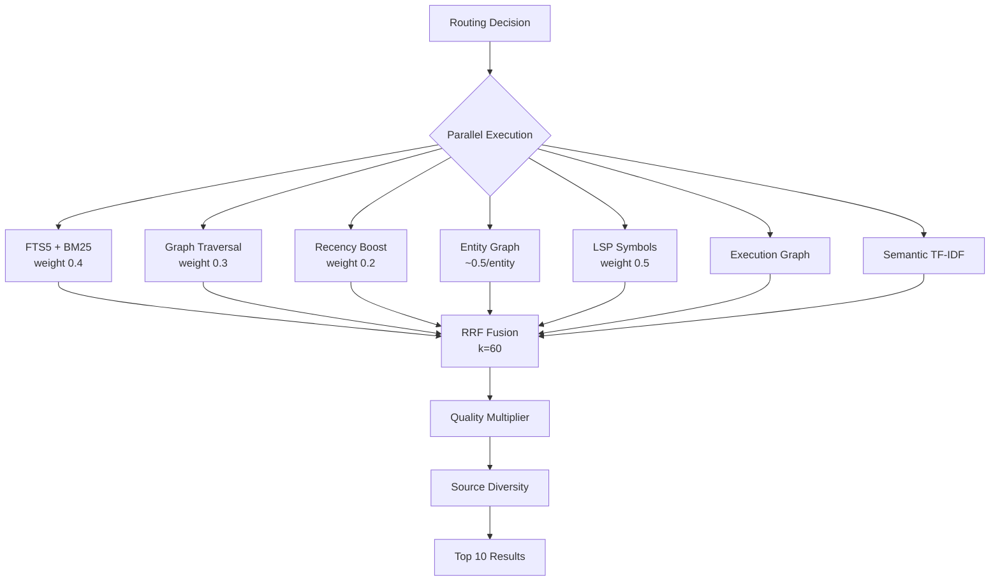
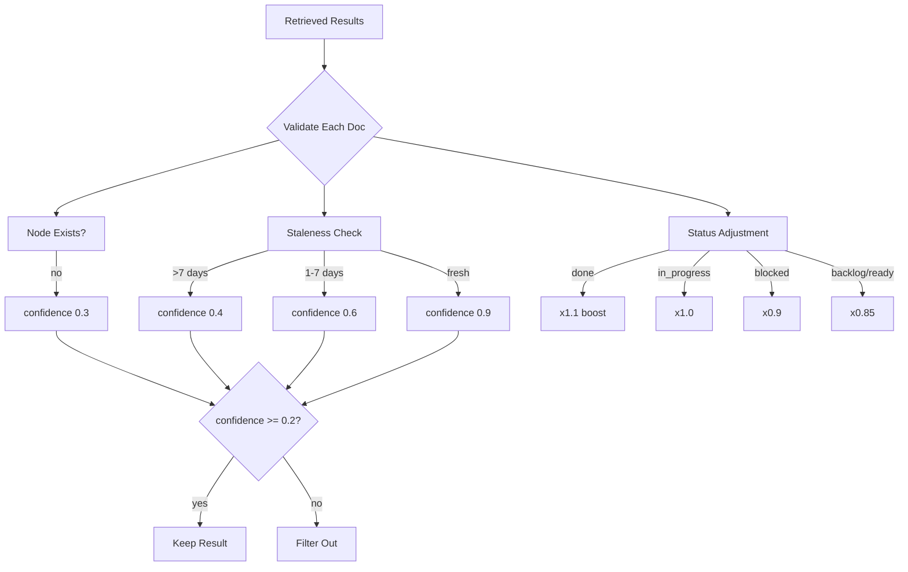
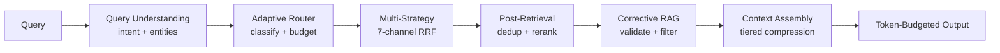

# RAG Strategies Reference

> mcp-graph implements 4 retrieval strategies coordinated by an Adaptive Router.
> All strategies are **100% local** (SQLite + TF-IDF) with zero external API dependencies.

## Strategy Overview

| Strategy | File | Purpose | When Used |
|----------|------|---------|-----------|
| **Adaptive Router** | `adaptive-router.ts` | Query classification + routing | Every query |
| **Multi-Strategy Retrieval** | `multi-strategy-retrieval.ts` | 7-channel parallel search + RRF fusion | After routing |
| **Corrective RAG** | `corrective-rag.ts` | Temporal validation + confidence scoring | Post-retrieval |
| **Graph Community** | `graph-rag-strategy.ts` | Hierarchical clustering via execution graph | Complex queries |

---

## 1. Adaptive Router

Routes queries to the optimal strategy set based on complexity classification.



### Complexity Classification

| Complexity | Criteria | Strategies | Token Budget |
|------------|----------|-----------|--------------|
| **simple** | Status/history intents, <=1 entity, no source filter | fts, recency | 1,500 |
| **moderate** | How-to intent, 2-3 entities, source filters | fts, graph, recency, exec_graph, semantic | 3,000 |
| **complex** | Debug/compare intents, >3 entities, multi-source | fts, graph, recency, entity_graph, lsp, exec_graph, semantic | 6,000 |

### Configuration

- Sub-query decomposition: max 4 entities, splits on conjunctions (`and`, `e`, `with`, `com`, `versus`, `vs`)
- Performance: simple queries ~3x faster than complex path

### Benchmark (Real Data)

| Operation | Throughput | Latency (mean) |
|-----------|-----------|----------------|
| Route simple query | 1,134,757 ops/s | 0.9us |
| Route moderate query | 1,090,242 ops/s | 0.9us |
| Route complex query | 1,051,628 ops/s | 1.0us |
| E2E simple (understand + route) | 685,919 ops/s | 1.5us |
| E2E complex (understand + route) | 268,956 ops/s | 3.7us |

---

## 2. Multi-Strategy Retrieval (7-Channel RRF)

Executes 1-7 independent retrieval strategies in parallel, merges via Reciprocal Rank Fusion (RRF).



### The 7 Strategies

| # | Strategy | Weight | Description |
|---|----------|--------|-------------|
| 1 | **FTS5 + BM25** | 0.4 | Full-text search with BM25 ranking on `knowledge_documents` |
| 2 | **Graph Traversal** | 0.3 | Follow `knowledge_relations` edges from FTS top-3 results |
| 3 | **Recency Boost** | 0.2 | Pre-computed `recency_score` column boost |
| 4 | **Entity Graph** | ~0.5 | Knowledge graph entity extraction + 2-hop subgraph expansion |
| 5 | **LSP Symbol Resolution** | 0.5 | Code context matching for PascalCase/camelCase entities |
| 6 | **Execution Graph** | implicit | Topology-based search via node/edge relations |
| 7 | **Semantic Embedding** | implicit | TF-IDF cosine similarity (~15-21% BEIR recall boost) |

### RRF Formula

```
rrfScore = SUM(1 / (k + rank_i))  where k = 60
finalScore = rrfScore * (0.5 + 0.5 * qualityScore)
```

- Source diversity enforcement: >=2 source types in top-3 results
- Max 10 results per strategy, max 10 final results

### Benchmark (Real Data)

| Operation | Throughput | Latency (mean) |
|-----------|-----------|----------------|
| BM25 ranking (50 chunks, k1=1.8) | 2,577 ops/s | 0.39ms |
| BM25-only (500 nodes) | 18,630 ops/s | 54us |
| Hybrid BM25+Semantic (100 nodes) | 1,760 ops/s | 568us |
| Hybrid BM25+Semantic (500 nodes) | 569 ops/s | 1.76ms |
| Semantic search (50 embeddings) | 4,060 ops/s | 246us |
| Semantic search (200 embeddings) | 636 ops/s | 1.57ms |

---

## 3. Corrective RAG

Validates retrieved documents against current execution graph state. Detects staleness, node deletions, and status changes. Adjusts confidence scores to filter outdated knowledge.



### Validation Logic

| Check | Condition | Confidence | Description |
|-------|-----------|-----------|-------------|
| Node missing | `metadata.nodeId` not in graph | 0.3 | Referenced node was deleted |
| Stale | Node updated >7 days after doc | 0.4 | Knowledge likely outdated |
| Aging | Node updated 1-7 days after doc | 0.6 | Knowledge possibly outdated |
| Fresh | Node unchanged since doc creation | 0.9 | Knowledge current |

### Status Multipliers

| Status | Multiplier | Rationale |
|--------|-----------|-----------|
| `done` | x1.1 | Stable, finalized knowledge |
| `in_progress` | x1.0 | Actively evolving |
| `blocked` | x0.9 | May be outdated |
| `backlog`/`ready` | x0.85 | Preliminary knowledge |

### Cross-Reference Verification

Detects claims about dependencies, status, and relationships using pattern matching:
- `"depends on"`, `"depende de"`, `"blocks"`, `"bloqueia"`
- `"is done"`, `"esta in_progress"`, `"was blocked"`

---

## 4. Graph Community Detection

Groups nodes into thematic communities based on shared root epics, enabling retrieval of "entire community context" rather than individual document hits.

```mermaid
graph TD
    Q[Query] --> FTS[FTS Match Nodes]
    FTS --> BFS[BFS Expansion<br/>max 2 hops]
    BFS --> C[Community Detection<br/>walk to root epic<br/>max 10 levels]
    C --> G1[Community: Auth Epic]
    C --> G2[Community: API Epic]
    C --> G3[Community: DB Epic]
    G1 --> D1[All docs in community]
    G2 --> D2[All docs in community]
    D1 --> P[Proximity Scoring<br/>1/(1+distance)]
    D2 --> P
    P --> OUT[Community-Enriched Results]
```

### Key Parameters

| Parameter | Value | Description |
|-----------|-------|-------------|
| Max parent chain depth | 10 levels | Walk up to root epic |
| BFS max hops | 2 | Expansion radius |
| Max results | 20 | Community doc limit |
| Proximity formula | `1/(1+distance)` | Inverse distance scoring |
| Grouping criteria | `type === "epic"` | Root node detection |

---

## Pipeline Integration

All 4 strategies work together in a sequential pipeline:



### Key Numeric Constants

| Constant | Value | Module |
|----------|-------|--------|
| RRF k | 60 | Multi-Strategy |
| BM25 k1 | 1.8 | FTS ranking |
| Max strategies | 7 | Multi-Strategy |
| Staleness threshold | 7 days | Corrective RAG |
| Min confidence | 0.2 | Corrective RAG |
| Embedding cache size | 200 queries | RAG pipeline |
| Embedding cache TTL | 10 min | RAG pipeline |
| Context tiers | 20/150/500+ tokens | Context assembly |

### MCP Tool Usage

```bash
# Basic RAG context (auto-selects strategy based on query complexity)
rag_context({ nodeId: "node_abc", detail: "standard" })

# Deep context with higher token budget
rag_context({ nodeId: "node_abc", detail: "deep", budget: 8000 })

# Reindex knowledge store (rebuild embeddings)
reindex_knowledge({ scope: "all" })
```

> Full architecture: [RAG-ARCHITECTURE.md](../architecture/RAG-ARCHITECTURE.md) | Benchmark: `npx vitest bench`
